# Звіт – копія для ші.docx

## **Проєкт**: CyberTactics

## **GitHub**: <https://github.com/Serhii-Smoliak/cs-diploma>

## Загальний план дипломного проєкту на 8 тижнів

| **Тиждень** | **Фокус**                                                            | **Результат**                                                                                                   |
|-------------|----------------------------------------------------------------------|-----------------------------------------------------------------------------------------------------------------|
| 1           | Концепція, проблема, цілі, MVP-прототип, початкова модель загроз     | Зафіксовано ідею платформи, цільову аудиторію, проблему, MVP, базову архітектуру, першу версію threat model     |
| 2           | Навчальна логіка першої місії + MITRE для новачків + deployment plan | Перша місія стає зрозумілою для користувача без досвіду; описано базовий план деплою                            |
| 3           | Безпека платформи                                                    | Додано ролі, admin-захист, базовий access control для критичних endpointʼів                                     |
| 4           | Розширення навчального контенту                                      | Додано/уточнено завдання, рівні складності, сценарії атак, пояснення “що / навіщо / результат”                  |
| 5           | CI/CD security pipeline                                              | Автоматизовано перевірки коду, залежностей і контейнера перед деплоєм; налаштовано security gates у GitHub Actions |
| 6           | Security testing, стабілізація MVP, документація                     | Проведено базові security-тести, стабілізовано MVP, оновлено API/архітектурну документацію, підготовлено деплой |
| 7           | Полірування та фіналізація                                           | UI/UX, тексти, скриншоти, фінальний деплой демо, фінальний звіт                                                 |
| 8           | Захист                                                               | Презентація, демо, фінальна підготовка до захисту                                                               |

# **Звіт**

## **Тиждень 1**

### **План:**

1. Опрацювати концепцію проєкту  
   * сформулювати проблему;  
   * пояснити, чому вона важлива для cybersecurity;  
   * визначити цілі проєкту;  
   * показати, чим CyberTactics відрізняється від Hack The Box / TryHackMe.
2. Зробити попередній аналіз підходів  
   * які рішення вже існують;  
   * їхні сильні/слабкі сторони;  
   * у чому практична цінність твоєї платформи.
3. Сформувати початковий MVP  
   * базова архітектура;  
   * стек технологій;  
   * мінімальний функціонал;  
   * або mockup/прототип, якщо MVP ще не готовий.
4. Окреслити початкову модель загроз  
   * активи;  
   * довірені/недовірені компоненти;  
   * потенційні вектори атак;  
   * технічні й етичні ризики.
5. Підготувати перший weekly report  
   * що зроблено;  
   * які ризики;  
   * які виклики;  
   * посилання на артефакти;  
   * план роботи на наступний тиждень

### **1\. Опрацювання початкової концепції проєкту**

CyberTactics — це інженерний cybersecurity-проєкт у форматі навчальної гейміфікованої вебплатформи для вивчення логіки кібератак, технік MITRE ATT&CK та етапів Cyber Kill Chain.

Основна проблема, яку вирішує проєкт: новачкам складно почати вивчати кібербезпеку через високий поріг входу. Платформи на кшталт Hack The Box або TryHackMe часто потребують попередніх знань: Linux, мережі, термінал, VPN, базова exploit-логіка, web-security. Через це користувач без бази швидко стикається не з навчанням, а з технічним бар’єром.

CyberTactics має вирішити цю проблему через просту браузерну симуляцію атак, де користувач поступово проходить місії, виконує короткі завдання та отримує пояснення:

* що саме відбувається;
* навіщо використовується конкретна техніка;
* який результат вона дає;
* як вона пов’язана з наступним етапом атаки;
* як це співвідноситься з MITRE ATT&CK.

Проєкт орієнтований на школярів, студентів, junior pentesters, розробників, QA, DevOps/DevSecOps та інших спеціалістів суміжних IT-напрямів, які хочуть зрозуміти offensive security з нуля.

Практична цінність проєкту полягає в тому, що він не просто дає набір технічних задач, а допомагає зібрати знання в єдину послідовну систему через місії, сценарії атак, MITRE ATT&CK, гейміфікацію та поетапне пояснення логіки атак.

Поточна концепція CyberTactics уже описана як освітня гейміфікована платформа для вивчення кібербезпеки через симуляцію сценаріїв атак, де опорою для контенту є MITRE ATT&CK.

### **2\. Попередній аналіз можливих підходів**

Було розглянуто кілька підходів до навчання кібербезпеці:

| **Підхід**                     | **Переваги**                                        | **Недоліки**                                                   |
|--------------------------------|-----------------------------------------------------|----------------------------------------------------------------|
| Класичні курси                 | Добре пояснюють теорію                              | Мало практики, слабкий зв’язок із реальними атаками            |
| CTF / Hack The Box / TryHackMe | Дають практику                                      | Складні для повних новачків                                    |
| Лабораторії з VM               | Реалістичні                                         | Потребують налаштування середовища                             |
| Тести awareness                | Прості                                              | Часто нудні й поверхневі                                       |
| CyberTactics                   | Простий старт, поетапна логіка, MITRE, гейміфікація | Потребує якісного навчального контенту та контролю етичних меж |

Обраний підхід: браузерна навчальна платформа, яка не запускає реальний шкідливий код, а симулює логіку атаки та перевіряє розуміння користувача через завдання. Для MVP використовується перевірка логіки відповіді, а не виконання небезпечного коду.

### **3\. Цілі проєкту**

Основні цілі проєкту:

1. Розробити MVP навчальної платформи з кібербезпеки.
2. Знизити поріг входу для користувачів без досвіду.
3. Пояснювати offensive security через прості поетапні завдання.
4. Використати MITRE ATT&CK як основу для структурування навчального контенту.
5. Реалізувати місії, рівні, прогрес користувача та гейміфікацію.
6. Дати користувачу розуміння не лише “що зробити”, а й “навіщо це робиться”.
7. Створити безпечне навчальне середовище без виконання реального шкідливого коду.
8. Підготувати основу для подальшого розширення контенту, сценаріїв і defensive-пояснень.

### **4\. Опрацювання первинної версії MVP**

На першому тижні було підготовлено та частково реалізовано початковий MVP CyberTactics.

**Реалізовано**:

| **Напрям**     | **Поточний результат**                                             |
|----------------|--------------------------------------------------------------------|
| Frontend       | React + Vite, сторінки місій, завдань, ігровий екран, Skill Matrix |
| Backend        | Express API, авторизація JWT, робота з місіями, рівнями, прогресом |
| База даних     | PostgreSQL + Prisma ORM                                            |
| MITRE ATT&CK   | Синхронізація STIX-даних, збереження технік у БД                   |
| Гейміфікація   | XP, ранги, Stealth, прогрес користувача                            |
| Завдання       | Code editor, tactical choice, phishing constructor                 |
| Локалізація    | i18next + переклади з БД                                           |
| Інфраструктура | Docker Compose для PostgreSQL, Dockerfile для backend              |

У документації MVP зафіксовано, що вже реалізовано реєстрацію/вхід, CRUD місій і рівнів, відправку відповідей, прогрес, XP, Stealth, MITRE sync, Skill Matrix, переклади та базову локалізацію.

Архітектура побудована як frontend → backend API → PostgreSQL. Frontend працює через React + Vite, backend — через Express, middleware, services та Prisma.

### 

### **5\. Початкова модель загроз**

Для першого етапу сформовано початкову модель загроз саме для навчальної cybersecurity-платформи.

#### **Основні активи**

* акаунти користувачів;
* JWT-токени;
* прогрес проходження;
* XP, ранги, Stealth;
* навчальний контент;
* місії та рівні;
* MITRE ATT&CK дані;
* переклади;
* адміністративні endpointʼи;
* механізм перевірки відповідей.

#### **Довірені компоненти**

* backend-сервер;
* база даних PostgreSQL;
* серверна логіка перевірки відповідей;
* офіційне джерело MITRE CTI;
* контрольовані JSON-сценарії рівнів.

#### **Недовірені компоненти**

* користувацьке введення;
* відповіді на завдання;
* frontend-стан у браузері;
* localStorage;
* будь-які API-запити з клієнта;
* потенційно змінюваний навчальний контент;
* незахищені адміністративні endpointʼи.

#### **Початковий STRIDE-аналіз**

| STRIDE                 | Потенційний ризик              | Приклад                                          |
|------------------------|--------------------------------|--------------------------------------------------|
| Spoofing               | Підміна користувача            | Використання чужого JWT                          |
| Tampering              | Зміна прогресу або результатів | Спроба підмінити XP, Stealth або completed level |
| Repudiation            | Заперечення виконаних дій      | Користувач заперечує проходження рівня           |
| Information Disclosure | Витік даних                    | Email, прогрес, службові API, навчальний контент |
| Denial of Service      | Перевантаження системи         | Масові submit-запити або MITRE sync              |
| Elevation of Privilege | Доступ до admin-функцій        | Виклик MITRE sync або translations API без прав  |

Поточні важливі ризики: MITRE sync і translations API поки потребують admin-захисту, а AST-валідація коду реалізована спрощено.

### 

### 

### **6\. Технічні та етичні ризики**

| Ризик                                              | Чому важливо                                                       | План реагування                                        |
|----------------------------------------------------|--------------------------------------------------------------------|--------------------------------------------------------|
| Offensive-контент може бути неправильно сприйнятий | Користувач може сприйняти матеріал як інструкцію для реальних атак | Додавати defensive-контекст та етичні обмеження        |
| Новачок може не зрозуміти логіку атаки             | Платформа втратить навчальну цінність                              | Додавати пояснення “що / навіщо / результат”           |
| Механічне проходження завдань                      | Користувач буде гнатись за XP, а не за розумінням                  | Прив’язати прогрес до пояснень і правильного розуміння |
| Незахищені admin endpointʼи                        | Ризик зміни системних даних                                        | Додати ролі та access control                          |
| Спрощена валідація відповідей                      | Можливі некоректні результати                                      | Покращити перевірку відповідей                         |
| Часткова локалізація                               | Частина UI може бути незрозумілою                                  | Поступово винести всі рядки в i18n                     |

### **7\. Виконані завдання за тиждень**

За перший тиждень виконано:

* сформовано концепцію CyberTactics;
* визначено проблему та цільову аудиторію;
* описано практичну цінність проєкту;
* визначено основні цілі MVP;
* реалізовано базову архітектуру;
* реалізовано frontend-частину з основними сторінками;
* реалізовано backend API;
* налаштовано PostgreSQL + Prisma;
* реалізовано авторизацію через JWT;
* реалізовано місії, рівні та прогрес користувача;
* реалізовано XP, ранги та Stealth;
* реалізовано Skill Matrix;
* реалізовано MITRE ATT&CK sync;
* реалізовано базову локалізацію;
* підготовлено технічну документацію MVP;
* сформовано початкову модель загроз;
* визначено довірені та недовірені компоненти;
* зафіксовано первинні гіпотези щодо ризиків і вразливостей.

### **8\. План роботи на наступний тиждень**

На наступний тиждень заплановано зосередитися не на великій технічній доробці, а на покращенні навчальної цінності першої місії та уточненні deployment plan.

План:

1. Доопрацювати першу місію як навчальний сценарій для новачка.
2. Додати прості пояснення до MITRE-технік:  
   * що це;  
   * навіщо використовується;  
   * який результат дає;  
   * як пов’язано з наступним етапом атаки.
3. Описати зв’язок між завданнями місії та Cyber Kill Chain.
4. Уточнити початкову модель загроз саме для навчальної cybersecurity-платформи.
5. Підготувати демонстраційний сценарій проходження першої місії зі скриншотами.
6. Уточнити deployment plan:  
   * визначити варіант розгортання демо;  
   * описати мінімальні вимоги для запуску;  
   * зафіксувати необхідні env-змінні;  
   * описати порядок запуску backend, frontend і PostgreSQL.

### **9\. Артефакти**

* Репозиторій: <https://github.com/Serhii-Smoliak/cs-diploma>
* Документація MVP: <https://github.com/Serhii-Smoliak/cs-diploma/blob/main/README.md>
* Скриншоти інтерфейсу:  
   * сторінка місій:

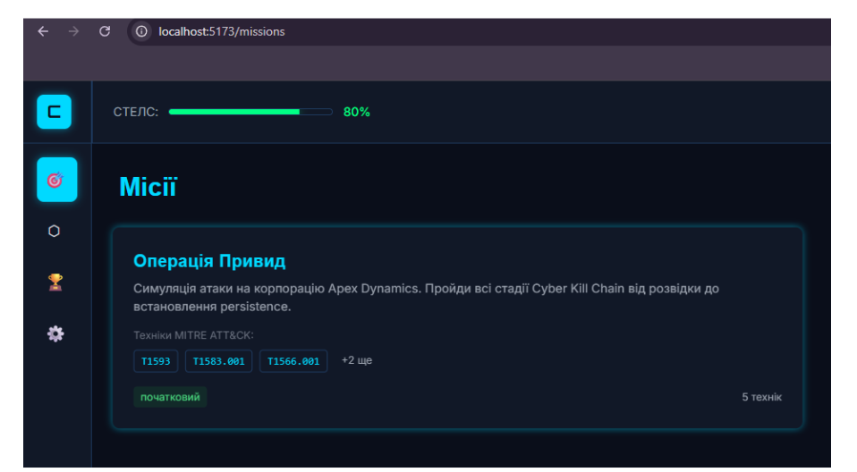

* * список завдань місії:

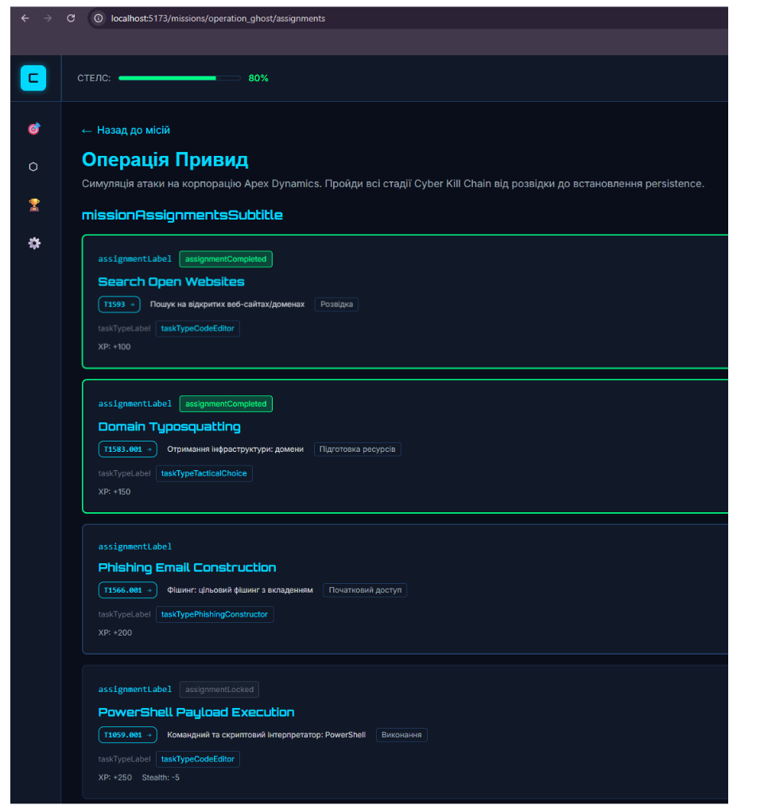

* * ігровий екран:

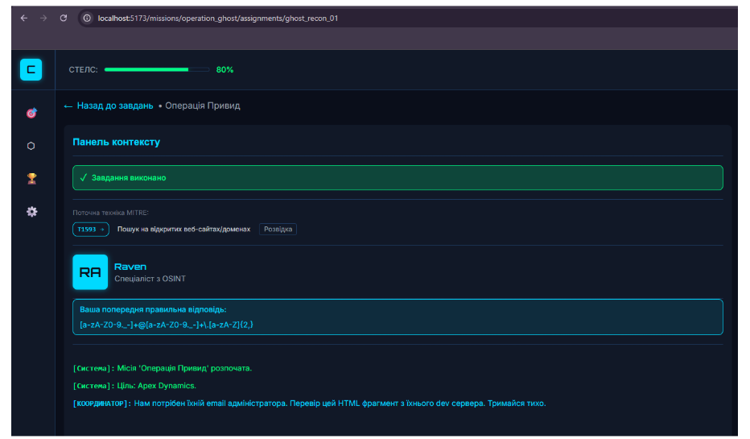

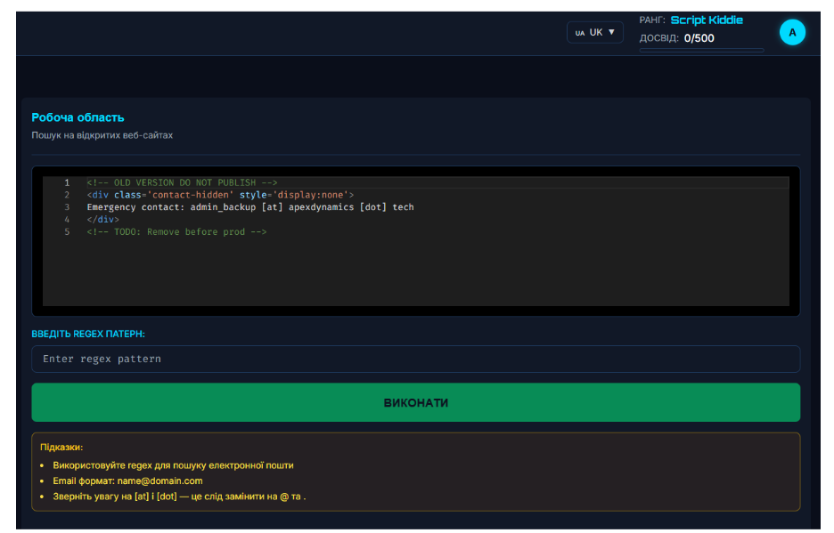

* * MITRE Skill Matrix:

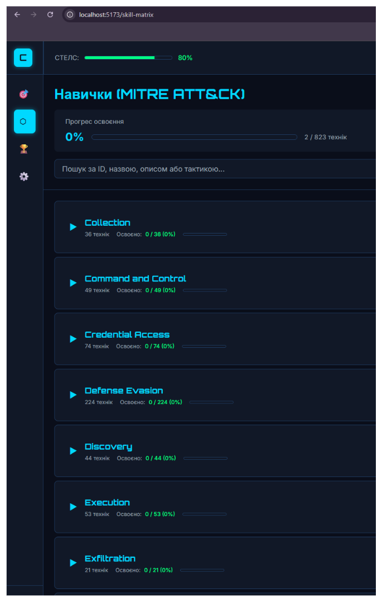

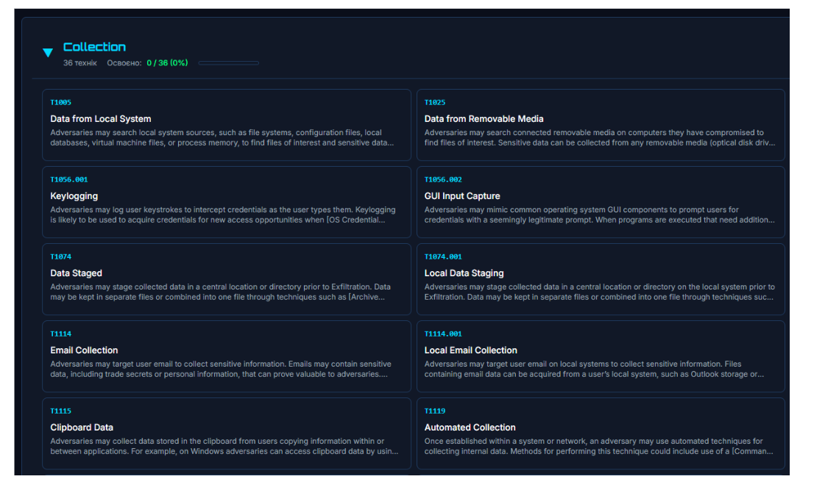

* * MITRE modal:

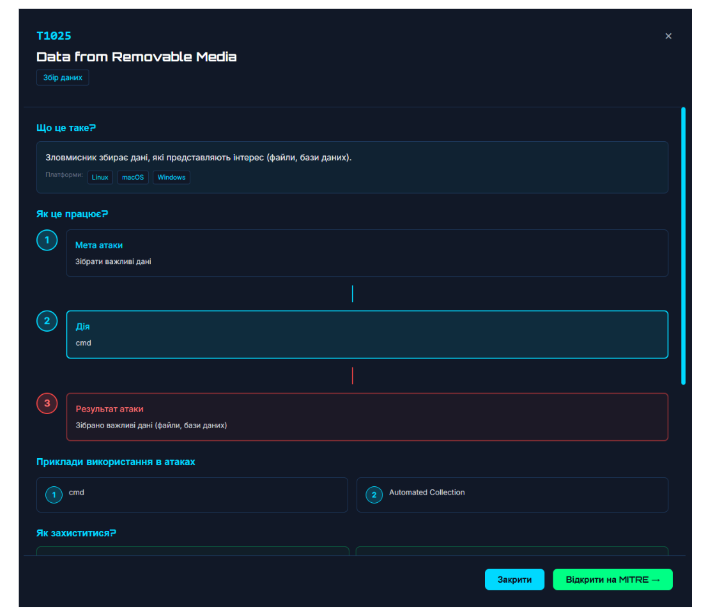

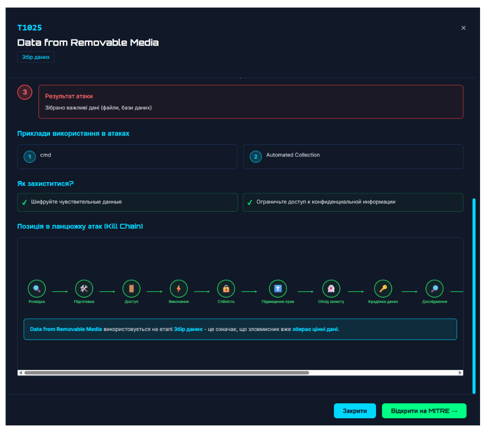

* * перемикання мов:

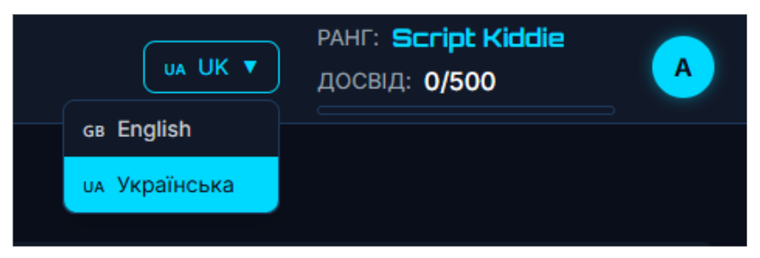

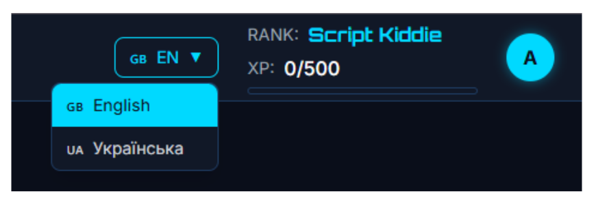

* Попередній deployment plan:  
   * Компоненти для розгортання:  
         * Frontend  
         * Backend  
         * Database  
   * Варіанти розгортання:  
         * Local demo - Для розробки та тестування  
         * VPS demo - Для показу керівнику / захисту  
         * Docker-based setup - Для стабільного повторюваного запуску  
         * Frontend hosting + backend VPS - Можливий фінальний варіант
* Docker Compose: <https://github.com/Serhii-Smoliak/cs-diploma/blob/main/server/docker-compose.yml>
* Dockerfile: <https://github.com/Serhii-Smoliak/cs-diploma/blob/main/server/Dockerfile>
* Спільна бібліотека, в на останніх етапах переїде до NPM:
* Frontend: <https://github.com/Serhii-Smoliak/cs-diploma/tree/main/client>
* Backend: <https://github.com/Serhii-Smoliak/cs-diploma/tree/main/server>

### **10\. Висновок**

За перший тиждень було виконано основні завдання стартового етапу дипломного проєкту. Сформовано концепцію CyberTactics як інженерної навчальної cybersecurity-платформи, визначено проблему, цільову аудиторію, цілі проєкту та практичну цінність рішення.

Було проведено попередній аналіз підходів до навчання кібербезпеці та визначено, що ключова відмінність CyberTactics полягає у зниженні порогу входу для новачків через прості поетапні завдання, гейміфікацію, пояснення логіки атак і прив’язку до MITRE ATT&CK.

Також було підготовлено початковий MVP: реалізовано базову архітектуру, frontend, backend, базу даних, авторизацію, місії, рівні, прогрес користувача, XP, Stealth, Skill Matrix, MITRE sync та базову локалізацію. Додатково сформовано початкову модель загроз, визначено довірені й недовірені компоненти, а також первинні технічні та етичні ризики.

Отже, очікувані результати першого тижня виконані: проведено аналіз проблеми, визначено цілі, підготовлено початковий MVP, зафіксовано модель загроз і сформовано перший звіт про прогрес. Наступний етап буде зосереджений на покращенні навчальної логіки першої місії та уточненні плану розгортання MVP.

## **Тиждень 2**

### **Фокус**

Покращити навчальну цінність першої місії та уточнити deployment plan.

### **План**

1. Доопрацювати першу місію як навчальний сценарій для новачка.
2. Додати прості пояснення до MITRE-технік:  
   * що це;  
   * навіщо використовується;  
   * який результат дає;  
   * як це пов’язано з наступним етапом атаки.
3. Описати зв’язок між завданнями місії та Cyber Kill Chain.
4. Уточнити початкову модель загроз саме для навчальної cybersecurity-платформи.
5. Підготувати демонстраційний сценарій проходження першої місії зі скриншотами.
6. Уточнити deployment plan:  
   * де буде розгорнуто демо;  
   * які мінімальні вимоги для запуску;  
   * які потрібні env-змінні;  
   * як запускати backend, frontend і PostgreSQL.

### **Виконані завдання за тиждень**

За цей етап доопрацьовано навчальний досвід місії Operation Ghost:

* покращено інтерфейс
* реалізовано сценарний діалог без підглядання відповідей
* додано механіку Stealth як модель ризику викриття
* створено новий тип завдання для фішингу
* додано профіль гравця та локалізацію.

Технічна документація і план перевірки безпеки підготовлені для наступних етапів дипломного проєкту.

**Документація**

* Описано покроковий запуск проєкту після клонування репозиторію: база даних, сервер, синхронізація бази технік MITRE ATT&CK, тестові дані, клієнт.
* Уточнено різницю між повним наповненням бази та оновленням лише перекладів. Повне наповнення скидає тестового користувача і прогрес, оновлення перекладів зберігає прогрес.
* Налаштовано перевірку якості коду: лінтер і форматування.
* README спрощено. Детальний опис системи винесено в технічну документацію проєкту.
* Описано механіку Stealth: як зменшується, відновлюється і що бачить користувач.
* У плані робіт зафіксовано етапи перевірки безпеки на фінальних тижнях: статичний аналіз, сканування вразливостей тощо.

**Зручність ігрового інтерфейсу**

* Робочу зону завдання зроблено ширшою, щоб було більше місця для введення відповіді.
* Виправлено відображення прокрутки. Текст більше не прилипає до краю.
* На екрані завдання назва місії та назва рівня показуються в одному рядку. Назва місії веде назад до списку завдань.
* На сторінці завдань місії показано повний перелік технік MITRE.
* На загальному списку місій залишено короткий вигляд: три техніки та позначка «ще N».
* Після проходження всіх рівнів Operation Ghost додано кнопку «Повернутися до списку місій».

**Панель контексту та діалог з координатором**

* Прибрано зайві блоки: аватар handler, окремі картки з правильною відповіддю та інші дублікати.
* Залишено техніку MITRE, повідомлення системи та координатора за сценарієм рівня.
* Після успішного виконання показується одне повідомлення координатора з текстом відповіді гравця.
* Відповіді у форматі листа, коду або команд показуються читабельно: з переносами рядків і без довгих рядків через крапку з комою.

**Навчальна безпека, підказки та повторне проходження**

* Правильна відповідь не показується до успішного виконання завдання.
* Правильна відповідь не передається в мережевих відповідях сервера до завершення рівня.
* Підказки доступні лише за запитом користувача.
* Після успішного виконання можна натиснути «Пройти заново» і повторити рівень.

**Механіка Stealth**

Stealth імітує ризик викриття операції. Помилки зменшують рівень прихованості. Якщо Stealth падає до нуля, гравець не може надіслати відповідь, доки не відновить ресурс.

Подія — ефект:

* Старт — 100%.
* Невірна відповідь — мінус 5%, значення налаштовується.
* Час — поступове відновлення.
* Stealth дорівнює 0 — блокування надсилання відповіді та вікно відновлення.

Варіанти відновлення в демо без реальної оплати:

* купити маскування — швидке відновлення до 50%;
* платний тариф — заготовка для майбутньої реалізації;
* зачекати — часткове відновлення після паузи.

Параметри інтервалу, штрафу та відновлення задаються в налаштуваннях сервера без зміни коду.

На екрані додано індикатор у шапці: зелений, жовтий або червоний стан. При спробі відповісти з нульовим Stealth відкривається модальне вікно відновлення.

**Рівень 3\. Конструктор фішинг-листа**

Замість вільного тексту листа, який складно перевіряти без ШІ, реалізовано конструктор з готових фраз.

* Гравець збирає тему, текст і вкладення з готових варіантів.
* Додано кілька допустимих правильних комбінацій.
* Для третього завдання Operation Ghost оновлено сценарій: українські формулювання та обов’язкове безпечне вкладення замість .exe.
* Усі вкладення можна обрати в інтерфейсі.
* Помилка визначається перевіркою відповіді, а не блокуванням кнопок.

**Профіль користувача**

* Додано сторінку профілю: ім’я, email, ранг, досвід і вихід з акаунта.
* Реалізовано фото профілю: вибір файлу, обрізання та збереження на сервері.
* Додано перехід у профіль через аватарку в шапці.
* Ранг користувача показується українською мовою.
* Додано розділ «Налаштування» як заготовку для майбутнього розвитку.

**Локалізація**

* Переклади зберігаються в базі даних.
* Оновлення перекладів виконується окремою командою без втрати прогресу користувача.
* Перекладено профіль, Stealth, повідомлення координатора, ранги та кнопки місій.
* Мова юзера зберігається в базі.
* При першому воді в додаток, юзеру надається можливість обрати одну з двух мов.

**Матриця навичок MITRE ATT&CK**

* Тактики за замовчуванням згорнуті, щоб екран не був перевантажений.
* Стан розгортання тактик запам’ятовується між відвідуваннями сторінки.

**Деплой**

Проєкт задеплоено на <https://railway.com>

Три сервери:

* DB
* FE
* BE

**Заплановано, але ще не реалізовано**

* Окрема сторінка ланцюга кібератаки з етапом «Розвідка», запланована на четвертий тиждень.

### **План роботи на наступний тиждень**

1. Додати ролі користувачів.
2. Реалізувати admin-захист для критичних endpointʼів.
3. Захистити:  
   1. MITRE sync;  
   2. translations API;  
   3. потенційні admin-операції.
4. Перевірити доступ до progress/stats тільки для власного користувача.
5. Оновити threat model після змін.
6. Створити Postman колекцію.

### **Артефакти**

* Сайт: <https://cs-diploma-fe-production.up.railway.app/>
* Креденшели:  
   * Логін: test1@cybertactics.test  
   * Пароль: test1123
* Репозиторій: <https://github.com/Serhii-Smoliak/cs-diploma>
* Документація MVP: <https://github.com/Serhii-Smoliak/cs-diploma/blob/main/README.md>
* Скриншоти інтерфейсу:

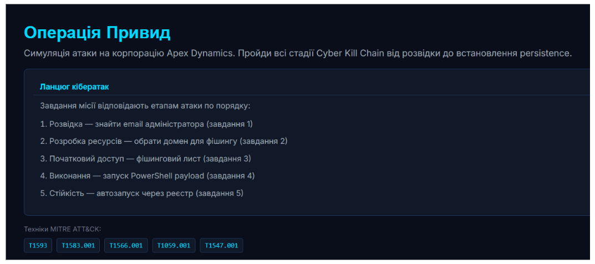

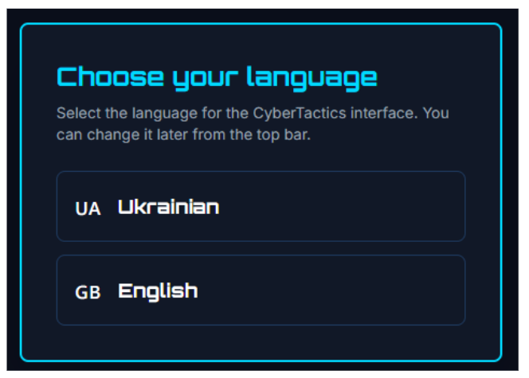

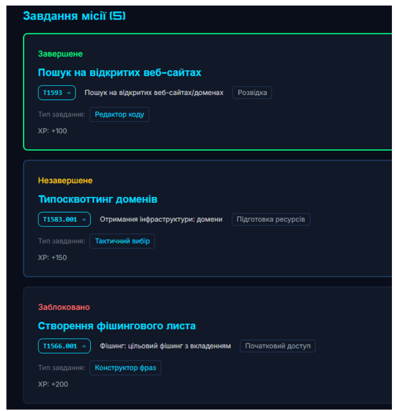

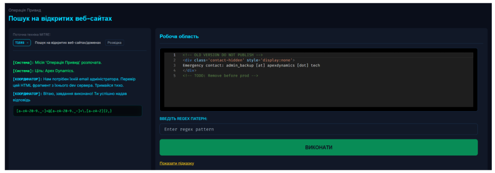

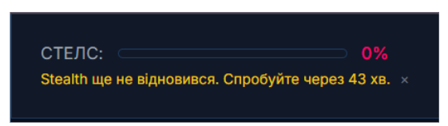

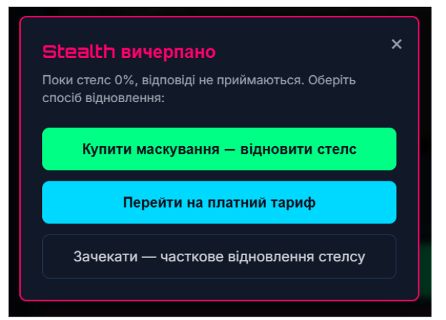

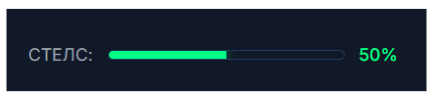

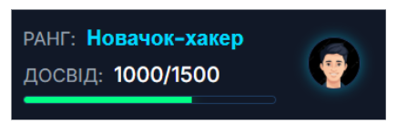

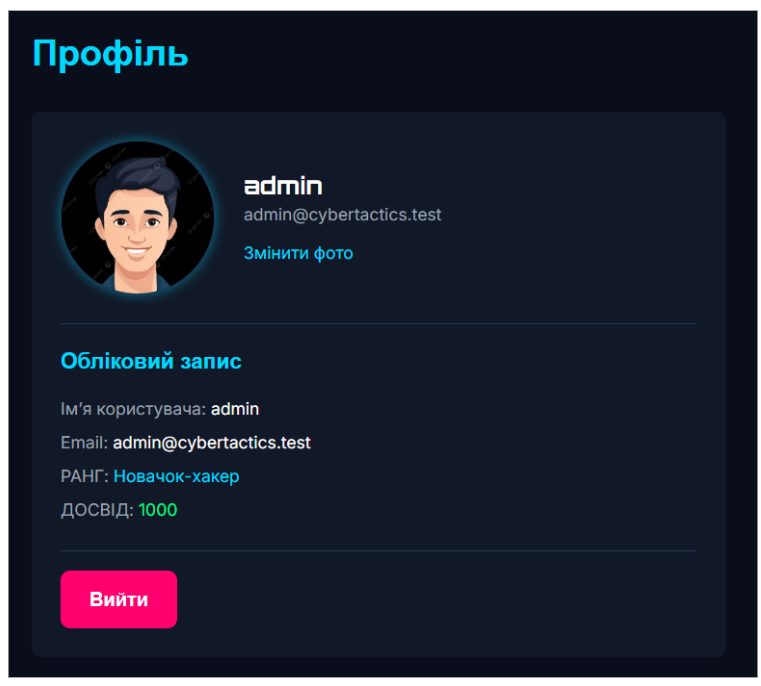

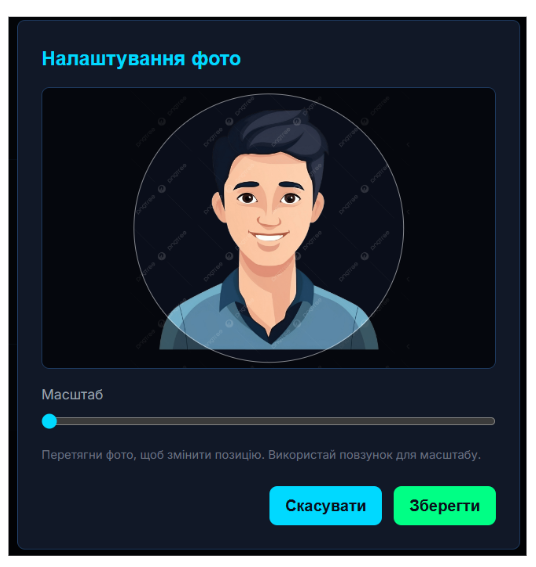

## 

## **Тиждень 3**

### **Фокус**

На третьому тижні основний фокус було зміщено з розширення функціоналу MVP на посилення безпеки платформи CyberTactics. Метою було зменшити ризики, визначені у первинній threat model, та почати застосовувати підхід secure software development на практиці.

### **План**

1. додати ролі користувачів;
2. реалізувати admin-захист для критичних endpointʼів;
3. захистити MITRE sync;
4. захистити translations API;
5. обмежити потенційні admin-операції;
6. перевірити, що progress/stats доступні лише власнику акаунта;
7. оновити threat model після впровадження змін.

### **Оновлена модель загроз після фокусу на безпеку**

Після аналізу первинної архітектури було визначено, що найбільш критичними точками ризику є адміністративні endpointʼи, MITRE sync, translations API, прогрес користувача та механізм нарахування XP/Stealth.

### **Основні активи**

* акаунти користувачів;
* JWT-токени;
* ролі користувачів;
* прогрес проходження;
* XP, ранги, Stealth;
* місії та рівні;
* MITRE ATT&CK дані;
* переклади;
* адміністративні endpointʼи;
* механізм перевірки відповідей.

### **Довірені компоненти**

* backend API;
* PostgreSQL;
* Prisma ORM;
* серверна логіка перевірки відповідей;
* middleware авторизації;
* RBAC-перевірки;
* офіційне джерело MITRE CTI;
* контрольовані JSON-сценарії рівнів.

### **Недовірені компоненти**

* користувацьке введення;
* відповіді на завдання;
* frontend-стан у браузері;
* localStorage;
* будь-які API-запити з клієнта;
* JWT після потрапляння на клієнт;
* запити до admin endpointʼів;
* потенційно змінюваний навчальний контент.

### **STRIDE-аналіз для ключових компонентів** 

#### **1\. Backend API** 

| **STRIDE**             | **Загроза**                                          | **Як проявляється**                                                    | **Контроль**                                  |
|------------------------|------------------------------------------------------|------------------------------------------------------------------------|-----------------------------------------------|
| Spoofing               | Підміна користувача                                  | Використання чужого або підробленого JWT                               | JWT validation, перевірка підпису, expiration |
| Tampering              | Зміна прогресу                                       | Користувач намагається напряму змінити XP, Stealth або completed level | Обчислення прогресу тільки на backend         |
| Repudiation            | Користувач заперечує проходження рівня або admin-дію | Користувач заперечує проходження рівня або admin-дію                   | Логування критичних дій                       |
| Information Disclosure | Витік чужого прогресу                                | Запит progress/stats іншого користувача                                | Перевірка userId з JWT                        |
| Denial of Service      | Масові submit-запити                                 | Навантаження на API через часті відповіді                              | Rate limiting                                 |
| Elevation of Privilege | Доступ до admin API                                  | Звичайний користувач викликає admin endpoint                           | RBAC middleware                               |

#### **2\. MITRE Sync** 

| **STRIDE**             | **Загроза**                             | **Як проявляється**                         | **Контроль**                         |
|------------------------|-----------------------------------------|---------------------------------------------|--------------------------------------|
| Spoofing               | Запит від неавторизованого користувача  | Будь-хто викликає sync endpoint             | Admin-only доступ                    |
| Tampering              | Підміна MITRE-даних                     | Неконтрольоване оновлення технік у БД       | Валідація джерела та структури даних |
| Repudiation            | Неможливо встановити, хто запустив sync | Admin запустив sync і заперечує це          | Audit log                            |
| Information Disclosure | Витік службових даних sync              | Endpoint повертає зайву технічну інформацію | Мінімізація response body            |
| Denial of Service      | Частий запуск sync                      | Перевантаження API або БД                   | Admin access + rate limit            |
| Elevation of Privilege | Звичайний user запускає sync            | Відсутність перевірки ролі                  | Role-based guard                     |

#### **3\. Translations API** 

| **STRIDE**             | **Загроза**                       | **Як проявляється**                  | **Контроль**             |
|------------------------|-----------------------------------|--------------------------------------|--------------------------|
| Spoofing               | Підміна адміністратора            | User викликає API перекладів         | Admin-only доступ        |
| Tampering              | Зміна перекладів                  | Підміна текстів навчального контенту | RBAC + validation        |
| Repudiation            | Заперечення зміни перекладу       | Немає історії змін                   | Логування admin-операцій |
| Information Disclosure | Витік службових ключів перекладів | API повертає зайві внутрішні поля    | Обмеження DTO            |
| Denial of Service      | Масові запити до перекладів       | Навантаження на API/DB               | Rate limiting/cache      |
| Elevation of Privilege | User змінює контент               | Немає перевірки ролі                 | Admin middleware         |

#### **4\. Progress / Stats** 

| **STRIDE**             | **Загроза**                  | **Як проявляється**                  | **Контроль**              |
|------------------------|------------------------------|--------------------------------------|---------------------------|
| Spoofing               | Доступ від імені іншого user | Підміна userId у запиті              | userId брати тільки з JWT |
| Tampering              | Накрутка XP/Stealth          | Користувач змінює payload            | Backend-only calculation  |
| Repudiation            | Заперечення проходження      | Немає історії submitʼів              | Логування submit result   |
| Information Disclosure | Перегляд чужої статистики    | Запит /users/:id/stats               | Ownership check           |
| Denial of Service      | Масові submit-запити         | Навантаження на перевірку відповідей | Rate limiting             |
| Elevation of Privilege | Доступ до чужого прогресу    | IDOR через userId                    | Ownership guard           |

### 

### 

### **Найкритичніші ризики після аналізу**

| **Ризик**                                   | **Категорія**          | **Критичність** | **Контроль**             |
|---------------------------------------------|------------------------|-----------------|--------------------------|
| Доступ звичайного користувача до MITRE sync | Elevation of Privilege | High            | Admin-only RBAC          |
| Зміна перекладів без прав                   | Tampering              | High            | Admin guard + validation |
| Перегляд чужого progress/stats              | Information Disclosure | High            | Ownership check          |
| Накрутка XP/Stealth                         | Tampering              | High            | Backend-only calculation |
| Масові submit/sync запити                   | DoS                    | Medium          | Rate limiting            |

### **Delta threat model**

Після додавання ролей користувачів, admin-захисту та ownership-перевірок модель загроз змінилась. 

Було:

* критичні endpointʼи могли бути потенційно доступні без достатнього контролю ролей;
* progress/stats потребували явної перевірки власника;
* MITRE sync і translations API були окремими ризиковими точками.

Стало:

* admin endpointʼи обмежуються RBAC;
* MITRE sync доступний лише адміністратору;
* translations API захищений ролями;
* progress/stats перевіряються через userId з JWT;
* XP/Stealth не приймаються напряму з клієнта, а мають обчислюватися на backend.

### **Перевірка бекенду інструментом OWASP ZAP**

### **APIs:**

* POST /auth/register
* POST /auth/login
* GET /missions
* GET /missions/:id/levels
* POST /levels/:id/submit
* GET /mitre/techniques
* GET /mitre/techniques/:id
* POST /mitre/sync
* GET /translations/languages
* GET /translations
* GET /translations/namespaces
* POST /translations
* POST /translations/bulk
* GET /users/me
* PUT /users/me/locale
* PUT /users/me/avatar
* POST /users/me/stealth/masking
* POST /users/me/stealth/wait
* GET /users/:id/progress
* GET /users/:id/stats

## Baseline security scan до впровадження виправлень

### Мета перевірки

Було виконано первинне security-тестування backend API CyberTactics до впровадження додаткових security controls. Мета перевірки — зафіксувати початковий стан безпеки платформи, виявити потенційні ризики та сформувати перелік проблем для подальшого remediation.

### Методика

Для перевірки було використано OWASP ZAP.

Послідовність дій:

1. Налаштовано проксі між Postman та OWASP ZAP.
2. Через Postman вручну викликано основні API endpointʼи платформи.
3. OWASP ZAP зібрав HTTP-запити та відповіді.
4. Після цього було виконано Full Active Scan.
5. Зібрано alerts, описи проблем, групування за категоріями та скріншоти результатів.

Перевірка виконувалась для локального backend API:

<http://localhost:3001>

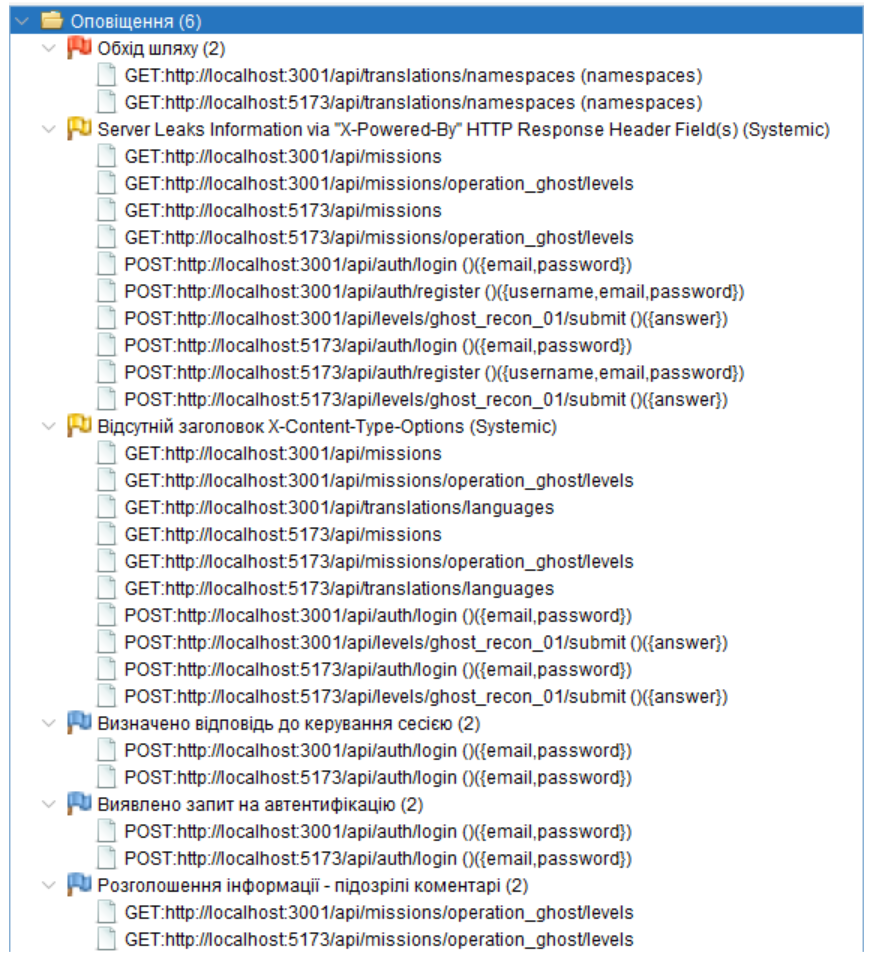

### 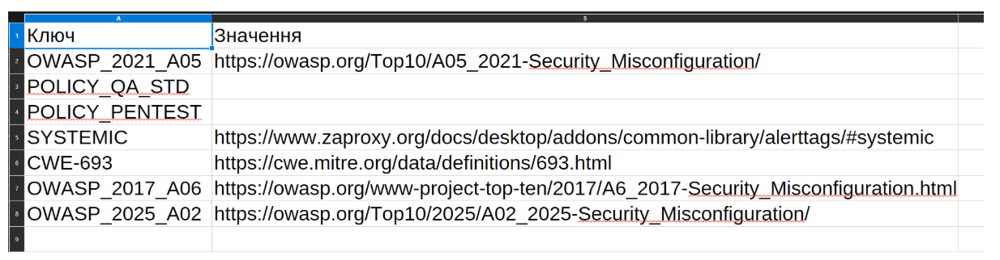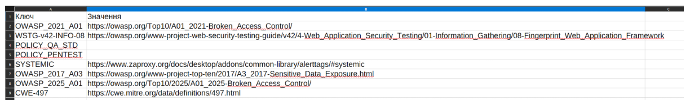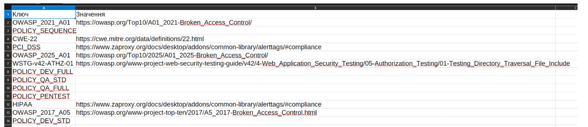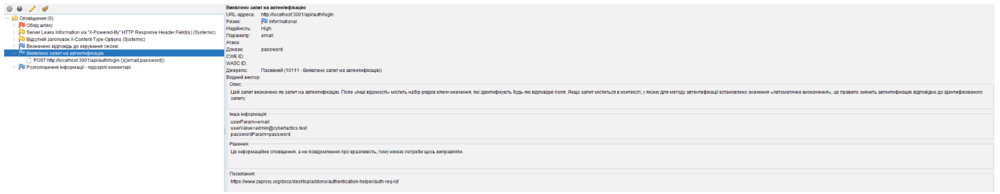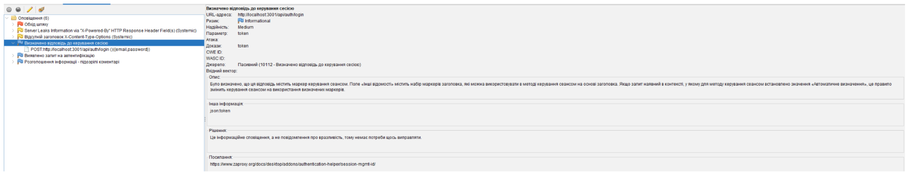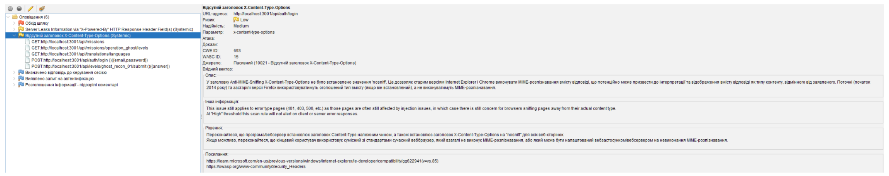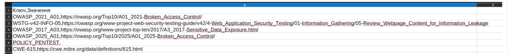

### Виявлені категорії alerts

| **№** | **Alert**                                 | **Ризик**     | **Надійність** | **OWASP / CWE**    | **Коментар**                                              |
|-------|-------------------------------------------|---------------|----------------|--------------------|-----------------------------------------------------------|
| 1     | Path Traversal                            | High          | Low            | OWASP A01, CWE-22  | Виявлено на translations/namespaces, параметр namespaces  |
| 2     | Missing X-Content-Type-Options            | Low           | Medium         | OWASP A05, CWE-693 | Відсутній security header X-Content-Type-Options: nosniff |
| 3     | Server leaks information via X-Powered-By | Low           | Medium         | OWASP A05, CWE-497 | Backend розкриває X-Powered-By: Express                   |
| 4     | Suspicious comments                       | Informational | Medium         | CWE-615            | У відповіді знайдено коментар TODO: Remove before prod    |
| 5     | Authentication request identified         | Informational | High           | Info               | ZAP визначив /auth/login як login endpoint                |
| 6     | Session management response identified    | Informational | Medium         | Info               | ZAP визначив token у відповіді login endpoint             |

### Детальний аналіз

#### 1\. Path Traversal на translations API

OWASP ZAP виявив потенційний ризик Path Traversal для endpointʼа:

GET /api/translations/namespaces?namespaces=namespaces

Проблема повʼязана з параметром namespaces, який потенційно може бути використаний для спроби доступу до небажаних ресурсів або обходу очікуваної логіки API.

Категорія:

* OWASP 2021 A01 — Broken Access Control
* CWE-22 — Improper Limitation of a Pathname to a Restricted Directory

Оцінка:

* Ризик: High
* Впевненість: Low

Висновок: це потребує ручної перевірки. Навіть якщо фактичного доступу до файлової системи немає, параметр namespaces треба обмежити whitelist-логікою та серверною валідацією.

План виправлення:

* дозволити тільки відомі namespace-значення;
* заборонити ../, /, \\, encoded path payloads;
* додати DTO/schema validation;
* не використовувати user input напряму для побудови шляхів або динамічних ключів;

#### 2\. Відсутній заголовок X-Content-Type-Options

ZAP виявив, що відповіді API не містять заголовок:

X-Content-Type-Options: nosniff

Цей заголовок зменшує ризик MIME-sniffing атак у браузері.

Категорія:

* OWASP 2021 A05 — Security Misconfiguration
* CWE-693 — Protection Mechanism Failure

Оцінка:

* Ризик: Low
* Впевненість: Medium

План виправлення:

* підключити helmet в Express;
* явно встановити X-Content-Type-Options: nosniff;
* перевірити повторним ZAP scan.

#### 3\. Розкриття технології через X-Powered-By

Backend повертає заголовок:

X-Powered-By: Express

Це не є критичною вразливістю, але допомагає fingerprintingʼу технологічного стеку.

Категорія:

* OWASP 2021 A05 — Security Misconfiguration
* CWE-497 — Exposure of Sensitive System Information

Оцінка:

* Ризик: Low
* Впевненість: Medium

План виправлення:

* вимкнути x-powered-by в Express;
* використовувати helmet.

#### 4\. Suspicious comments у відповіді API

У відповіді endpointʼа місій знайдено коментар:

TODO: Remove before prod

Це може розкривати внутрішню інформацію про стан розробки або незавершені частини функціоналу.

Категорія:

* CWE-615 — Inclusion of Sensitive Information in Source Code Comments

Оцінка:

* Ризик: Informational
* Впевненість: Medium

План виправлення:

* прибрати debug/TODO-коментарі з response;
* не повертати службову інформацію у production-відповідях;
* розділити dev/test/prod seed data.

#### 5\. Authentication request identified

ZAP визначив endpoint:

POST /api/auth/login

як запит автентифікації, оскільки він містить поля:

* email
* password

Це informational alert, а не вразливість.

Висновок: endpoint login коректно ідентифікований ZAP як authentication flow. Додатково потрібно перевірити rate limiting, generic error messages, password policy та захист від brute force.

#### 6\. Session management response identified

ZAP визначив, що відповідь login endpointʼа містить session/token marker:

token

Це informational alert, а не самостійна вразливість.

Висновок: потрібно окремо перевірити:

* expiration JWT;
* алгоритм підпису;
* відсутність sensitive data в payload;
* поведінку після logout;
* зберігання токена на frontend;
* захист від XSS.

### 

### 

### Звʼязок результатів OWASP ZAP зі STRIDE

Результати первинного OWASP ZAP scan було зіставлено з попередньою STRIDE-моделлю CyberTactics. Це дозволяє не просто зафіксувати alerts, а повʼязати їх із конкретними ризиками для платформи та визначити план подальших виправлень.

| **STRIDE**             | **Виявлений ризик**                       | **Як проявляється у CyberTactics**                                                             | **Контроль / план виправлення**                                                               |
|------------------------|-------------------------------------------|------------------------------------------------------------------------------------------------|-----------------------------------------------------------------------------------------------|
| Spoofing               | Потенційне зловживання auth/session flow  | ZAP визначив /api/auth/login як authentication endpoint та виявив token-based session response | Перевірити JWT expiration, signature validation, generic auth errors, rate limiting для login |
| Tampering              | Маніпуляція параметром namespaces         | ZAP виявив потенційний Path Traversal у GET /api/translations/namespaces?namespaces=namespaces | Додати whitelist allowed namespaces, schema validation, заборону ../, /, \\, encoded payloads |
| Repudiation            | Недостатня простежуваність критичних дій  | Для admin-операцій, MITRE sync, translations changes та submit actions потрібна історія дій    | Додати audit logging для admin-запитів, sync, змін перекладів і submit results                |
| Information Disclosure | Розкриття службової інформації            | Виявлено X-Powered-By: Express, TODO-коментар у response, auth/session markers                 | Вимкнути X-Powered-By, прибрати debug/TODO-коментарі, мінімізувати response body              |
| Denial of Service      | Потенційне перевантаження API             | Login, submit, translations та MITRE sync можуть бути викликані багато разів                   | Додати rate limiting, cache для translations, обмеження sync endpoint                         |
| Elevation of Privilege | Доступ до критичних API без належної ролі | Translations API та MITRE sync є потенційними admin-only зонами                                | Додати RBAC middleware, admin guard, ownership checks                                         |

### Найкритичніші ризики після OWASP ZAP baseline scan

| **Ризик**                                               | **Категорія**                     | **Критичність** | **Контроль**                           |
|---------------------------------------------------------|-----------------------------------|-----------------|----------------------------------------|
| Потенційний Path Traversal у translations API           | Tampering / Broken Access Control | High            | Whitelist namespaces + validation      |
| Доступ звичайного користувача до translations/admin API | Elevation of Privilege            | High            | Admin-only RBAC                        |
| Доступ звичайного користувача до translations/admin API | Information Disclosure            | High            | Ownership check через userId з JWT     |
| Можливий доступ до чужого progress/stats                | Information Disclosure            | Low             | Disable X-Powered-By, Helmet           |
| Розкриття технологічного стеку через X-Powered-By       | Security Misconfiguration         | Low             | Helmet, nosniff header                 |
| Відсутність X-Content-Type-Options                      | Information Disclosure            | Informational   | Прибрати службові коментарі з response |
| Потенційний brute force login endpoint                  | Denial of Service / Spoofing      | Medium          | Rate limiting, generic errors          |

### Пріоритет виправлення

| **Пріоритет** | **Проблема**                                | **Чому важливо**                                    | **Дія**                                 |
|---------------|---------------------------------------------|-----------------------------------------------------|-----------------------------------------|
| 1             | Path Traversal на translations/namespaces   | ZAP класифікував як High, навіть при Low confidence | Whitelist + validation + negative tests |
| 2             | Admin-захист translations API та MITRE sync | Це критичні endpointʼи для зміни системних даних    | RBAC middleware + admin guard           |
| 3             | Ownership check для progress/stats          | Захист від IDOR та перегляду чужого прогресу        | userId брати тільки з JWT               |
| 4             | Security headers                            | Зменшення security misconfiguration                 | Helmet                                  |
| 5             | Приховування Express fingerprint            | Зменшення information disclosure                    | app.disable('x-powered-by')             |
| 6             | Видалення TODO/debug comments               | Прибрати службову інформацію з API responses        | Очистити seed/content/response          |
| 7             | Auth hardening                              | Захист login flow                                   | Rate limit, generic errors, JWT review  |

### Після виправлення зауважень OWASP ZAP та повторного baseline маємо наступний результат:


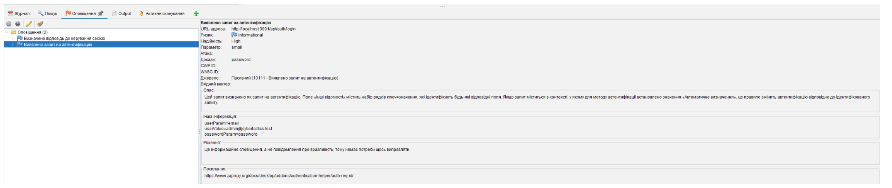

### Baseline-висновок

Після усунення зауважень, виявлених під час первинного OWASP ZAP scan, було виконано повторну перевірку backend API.

За результатами повторного baseline scan кількість оповіщень зменшилась до двох informational alerts:

* Authentication Request Identified;
* Session Management Response Identified.

Ці повідомлення не є вразливостями. OWASP ZAP лише визначив, що endpoint /api/auth/login використовується для автентифікації, а відповідь містить session/token marker.

Попередньо виявлені проблеми були усунені:

* потенційний Path Traversal у translations/namespaces більше не фіксується;
* відсутній X-Content-Type-Options більше не фіксується;
* X-Powered-By: Express більше не розкривається;
* TODO/debug-коментарі у відповідях API більше не виявляються;
* security headers були посилені;
* translations API отримав додаткову серверну валідацію;
* критичні admin endpointʼи були винесені під контроль доступу.

Таким чином, повторний OWASP ZAP scan підтвердив ефективність виконаних security controls. Стан “до / після” показує зменшення ризиків, повʼязаних із security misconfiguration, information disclosure та potential broken access control.

Залишкові alerts належать до інформаційного рівня і використовуються як підтвердження того, що ZAP коректно ідентифікує auth/session flow застосунку. Додаткових виправлень для цих повідомлень не потрібно, але auth flow надалі може бути посилений через rate limiting, generic error responses та перевірку JWT expiration.

### **Артефакти**

* Сайт: <https://cs-diploma-fe-production.up.railway.app/>
* Креденшели:  
   * Логін: test1@cybertactics.test  
   * Пароль: test1123
* Репозиторій: <https://github.com/Serhii-Smoliak/cs-diploma>

Документація MVP: <https://github.com/Serhii-Smoliak/cs-diploma/blob/main/README.md>

### 

## **Тиждень 4**

### **Фокус**

Security by Design для навчальної платформи CyberTactics.

### **Мета**

Метою четвертого тижня було перейти від точкового виправлення вразливостей після OWASP ZAP до формального опису безпеки на рівні архітектури, потоків даних, ролей, endpointʼів та правил доступу.

На попередньому етапі основна увага була на remediation після сканування: виправлення security headers, приховування службової інформації, посилення translations API та обмеження доступу до критичних endpointʼів. На четвертому тижні я сфокусувався на тому, щоб ці рішення були не просто окремими виправленнями, а частиною загального security-by-design підходу.

### **План**

1. Описати security requirements для платформи:  
   * автентифікація;  
   * авторизація;  
   * ролі користувачів;  
   * захист admin endpointʼів;  
   * ownership check;  
   * захист навчального контенту;  
   * захист progress / XP / Stealth;  
   * безпечна робота з MITRE sync;  
   * безпечна робота з translations API.
2. Додати security acceptance criteria для нових фіч:  
   * endpoint не доступний без JWT;  
   * admin endpoint доступний тільки admin;  
   * user не може читати чужий progress;  
   * user не може напряму змінити XP / Stealth;  
   * input проходить серверну валідацію;  
   * response не повертає службову інформацію;  
   * помилки не розкривають внутрішню реалізацію.
3. Переглянути архітектуру через принципи Security by Design:  
   * least privilege;  
   * secure defaults;  
   * defense in depth;  
   * fail securely;  
   * validate input on server;  
   * never trust frontend;  
   * minimize exposed attack surface.
4. Оновити DFD:  
   * frontend;  
   * backend API;  
   * PostgreSQL;  
   * MITRE CTI source;  
   * admin flows;  
   * auth flow;  
   * progress / stats flow;  
   * translations flow.
5. Позначити trust boundaries:  
   * browser → backend;  
   * backend → database;  
   * backend → external MITRE source;  
   * user API → admin API;  
   * public endpoints → protected endpoints.
6. Оновити threat model:  
   * додати нові потоки даних;  
   * уточнити ризики для admin API;  
   * уточнити ризики для progress / stats;  
   * уточнити ризики для translations API;  
   * описати, які ризики вже знижені після OWASP ZAP remediation.
7. Оновити risk register:  
   * ризик IDOR;  
   * ризик privilege escalation;  
   * ризик content tampering;  
   * ризик information disclosure;  
   * ризик brute force login;  
   * ризик DoS через submit/sync endpoints;  
   * ризик неправильного використання offensive-контенту.
8. Додати secure design decisions:  
   * XP / Stealth рахуються тільки на backend;  
   * userId береться тільки з JWT;  
   * admin endpoints захищені RBAC;  
   * translations namespace проходить whitelist validation;  
   * MITRE sync доступний тільки admin;  
   * debug/TODO інформація не повертається у response;  
   * security headers додаються централізовано;  
   * ZAP scan використовується як validation, а не як єдиний метод безпеки.
9. Підготувати security-by-design матрицю:

| **Принцип**             | **Як застосовано в CyberTactics**                                             |
|-------------------------|-------------------------------------------------------------------------------|
| Least Privilege         | User має доступ тільки до власного progress; admin API доступний тільки admin |
| Secure Defaults         | Нові endpointʼи за замовчуванням закриті                                      |
| Defense in Depth        | WT + RBAC + ownership check + validation                                      |
| Fail Securely           | При помилці доступ забороняється                                              |
| Input Validation        | namespaces, submit answers, auth payload проходять server-side validation     |
| Minimize Attack Surface | admin/sync endpoints обмежені                                                 |
| Never Trust Client      | XP, Stealth, completed levels не приймаються напряму з frontend               |

### **Очікуваний результат**

Після четвертого тижня платформа має бути описана не просто як веб-додаток, який перевірили OWASP ZAP, а як система, в якій безпека враховується на рівні архітектури, потоків даних, ролей, endpointʼів, правил доступу та acceptance criteria.

Коротко формула:

**Тиждень 3:** знайшли й пофіксили проблеми.  
**Тиждень 4:** формалізуємо Security by Design, щоб новий функціонал одразу проєктувався безпечно.

**Якщо залишиться час, то можна покращити функціональні речі:**

1. Додати або покращити завдання в першій місії.
2. Додати рівні складності.
3. Покращити пояснення атак:  
   * контекст;  
   * дія;  
   * результат;  
   * захист / виявлення.
4. Додати більше defensive-пояснень, щоб offensive-контент був етично обмежений.
5. Перевірити, чи місія проходиться логічно від простого до складного.

### **Виконана робота**

За четвертий тиждень було виконано весь основний план. Додаткові функціональні задачі по розробці я не брав, оскільки основний фокус був саме на security-документації та формалізації безпечної архітектури.

Було підготовлено окрему security requirements документацію для платформи CyberTactics:

<https://github.com/Serhii-Smoliak/cs-diploma/blob/main/Security-requirements.md>

У документі описано основні вимоги безпеки для платформи:

* автентифікація користувачів;
* авторизація;
* ролі USER та ADMIN;
* захист admin endpointʼів;
* ownership check для progress/stats;
* захист навчального контенту;
* захист progress / XP / Stealth;
* безпечна робота з MITRE sync;
* безпечна робота з translations API.

Також були додані security acceptance criteria для нових фіч. Вони визначають, які умови повинні виконуватися перед тим, як новий функціонал можна вважати безпечним. Наприклад, protected endpointʼи не повинні бути доступні без JWT, admin endpointʼи мають бути доступні тільки адміністратору, користувач не повинен мати доступ до чужого progress/stats, а XP і Stealth не можуть змінюватися напряму з frontend.

Окремо було переглянуто архітектуру через принципи Security by Design:

* Least Privilege;
* Secure Defaults;
* Defense in Depth;
* Fail Securely;
* Input Validation;
* Minimize Attack Surface;
* Never Trust Client.

Для кожного принципу було описано, як саме він застосовується у CyberTactics. Наприклад, frontend вважається недовіреним, тому XP, Stealth і completed levels рахуються тільки на backend. UserId береться з JWT, а не з request body. Admin API захищений через RBAC, а роль перевіряється через базу даних.

Було оновлено DFD для основних потоків даних:

* frontend → backend API;
* backend API → PostgreSQL;
* backend API → MITRE CTI source;
* auth flow;
* admin flow;
* progress / stats flow;
* translations flow.

Також були явно позначені trust boundaries:

* browser → backend;
* backend → database;
* backend → external MITRE source;
* user API → admin API;
* public endpoints → protected endpoints.

Це дозволило показати, де саме проходять межі довіри і які перевірки потрібні на кожній межі.

Було оновлено threat model. У нього додано нові потоки даних, уточнено ризики для admin API, progress/stats і translations API. Також описано, які ризики були знижені після OWASP ZAP remediation: potential Path Traversal у translations API, відсутність security headers, розкриття X-Powered-By, TODO/debug інформація у response та недостатня валідація параметрів.

Було оновлено risk register. До нього додано ключові ризики:

* IDOR;
* privilege escalation;
* content tampering;
* information disclosure;
* brute force login;
* DoS через submit/sync endpointʼи;
* неправильне використання offensive-контенту.

Для кожного ризику описано вплив, ймовірність, поточні контролі, залишковий ризик і подальші рекомендації.

Також були зафіксовані secure design decisions:

* XP / Stealth рахуються тільки на backend;
* userId береться тільки з JWT;
* admin endpointʼи захищені RBAC;
* translations namespace проходить whitelist validation;
* MITRE sync доступний тільки admin;
* debug/TODO інформація не повертається у response;
* security headers додаються централізовано;
* ZAP scan використовується як validation, а не як єдиний метод безпеки.

Фінально була підготовлена security-by-design матриця, яка показує звʼязок між принципами безпечного проєктування і реалізацією цих принципів у CyberTactics.

### **Результат**

Після четвертого тижня платформа описана не лише як веб-додаток, який був перевірений OWASP ZAP, а як система, де безпека враховується на рівні архітектури.

Було формалізовано:

* security requirements;
* security acceptance criteria;
* DFD;
* trust boundaries;
* threat model;
* risk register;
* secure design decisions;
* security-by-design matrix.

Таким чином, робота четвертого тижня переводить безпеку CyberTactics з рівня “знайшли й виправили проблеми” на рівень “новий функціонал має проєктуватися безпечно з самого початку”.

### **Артефакти**

* Сайт: <https://cs-diploma-fe-production.up.railway.app/>
* Креденшели:  
   * Логін: test1@cybertactics.test  
   * Пароль: test1123
* Репозиторій: <https://github.com/Serhii-Smoliak/cs-diploma>
* Комміт Week 4: <https://github.com/Serhii-Smoliak/cs-diploma/commits/main/>
* Документація MVP: <https://github.com/Serhii-Smoliak/cs-diploma/blob/main/README.md>

## **Тиждень 5**

### **Фокус**

Побудова CI/CD security pipeline для CyberTactics.

### **Мета**

Метою пʼятого тижня було перейти від ручної перевірки безпеки до автоматизованого pipeline, який перевіряє код, залежності та Docker image перед деплоєм на Railway.

До цього push у `main` міг одразу запускати deploy без попередніх security checks. Після пʼятого тижня deploy у production відбувається лише після успішного проходження CI: спочатку Pull Request і GitHub Actions, потім merge в `main`, і тільки тоді Railway auto-deploy.

Коротко формула:

**Тиждень 4:** Security by Design на рівні архітектури.  
**Тиждень 5:** автоматизація перевірок через CI/CD security pipeline.

### **План**

1. Спроєктувати CI/CD pipeline: Push / PR → GitHub Actions → build/lint → SAST → dependency scan → container scan → deploy.
2. Налаштувати GitHub Actions workflow для backend, frontend і shared package.
3. Підключити SonarCloud для SAST і Quality Gate.
4. Додати перевірку npm-залежностей (npm audit + Dependabot).
5. Додати Snyk для сканування залежностей.
6. Додати container security scan (Trivy).
7. Змінити deploy flow: PR → green checks → merge → Railway.
8. Налаштувати branch protection на `main`.
9. Описати security gates і оновити документацію.

### **Виконана робота**

#### 1. GitHub Actions workflow

Створено `.github/workflows/security-ci.yml` з пʼятьма jobs:

| **Job** | **Інструмент** | **Що перевіряє** |
|---------|----------------|------------------|
| `Build & lint` | npm, tsc, eslint, prettier | shared → server → client: install, lint, format, build |
| `Dependency audit` | npm audit | CVE у залежностях (рівень critical) |
| `SonarCloud SAST` | SonarCloud | bugs, vulnerabilities, code smells, security hotspots, Quality Gate |
| `Snyk dependencies` | Snyk | vulnerable npm packages у server і client (severity ≥ high) |
| `Container scan (Trivy)` | Trivy | CRITICAL/HIGH CVE у Docker image backend |

Workflow запускається на `push` у `main` і на `pull_request`. Для паралельних запусків налаштовано `concurrency` з cancel-in-progress.

#### 2. SonarCloud

* Додано `sonar-project.properties` (org `serhii-smoliak`, projectKey `Serhii-Smoliak_cs-diploma`).
* У CI увімкнено `sonar.qualitygate.wait=true` — merge блокується, якщо Quality Gate не пройдено.
* Репозиторій імпортовано в SonarCloud; **Automatic Analysis** вимкнено, щоб уникнути конфлікту з CI-scan.
* GitHub Secret `SONAR_TOKEN` налаштовано для job `SonarCloud SAST`.

#### 3. Dependency scanning

* **npm audit** — окремі кроки для shared, server, client; fail при critical CVE.
* **Dependabot** — `.github/dependabot.yml`: щотижневі оновлення для shared, server, client і GitHub Actions.
* **Snyk** — matrix job для server і client; поріг `severity-threshold=high`; secret `SNYK_TOKEN`.

#### 4. Container scan

* Job `container-scan` збирає Docker image backend (`server/Dockerfile`) і сканує його Trivy (`aquasecurity/trivy-action@0.35.0`).
* Налаштовано `scanners: vuln`, `severity: CRITICAL,HIGH`, `ignore-unfixed: true`.
* Для зменшення false positives додано `skip-dirs` для системних npm-шляхів у базовому Node image.

#### 5. Docker і Railway

* Оновлено `server/Dockerfile` для monorepo: збірка shared + server, `npm ci`, `npm prune --omit=dev`, `apk upgrade` для системних пакетів.
* Додано `railway.toml` у корені репо для backend: build shared+server, start `node dist/index.js`.
* Міграція з yarn на npm: `package-lock.json` у server/client/shared, оновлено CI, Dockerfile, Railway і документацію.
* Backend (`cs-diploma-be`) і frontend (`cs-diploma-fe`) на Railway у статусі Online після merge в `main`.

#### 6. Branch protection і deploy flow

Налаштовано deploy flow для MVP:

```
Pull Request → GitHub Actions (усі jobs green) → merge в main → Railway auto-deploy
```

На гілці `main` увімкнено branch protection:

* require pull request before merging;
* require status checks: `Build & lint`, `Dependency audit`, `SonarCloud SAST`, `Snyk dependencies (server)`, `Snyk dependencies (client)`, `Container scan (Trivy)`;
* заборона direct push у `main`.

PR #16 змін CI/CD pipeline змержено в `main` після проходження всіх checks.

#### 7. Документація і security gates

* Створено `diploma-docs/ci-cd-pipeline.md` — схема pipeline, опис jobs, security gates, secrets, deploy flow.
* Оновлено `README.md`, `Security-requirements.md`, `DOCUMENTATION.md`.

Security gates блокують merge/deploy, якщо:

* build, lint або typecheck не пройшли;
* npm audit знайшов critical CVE;
* Sonar Quality Gate failed;
* Snyk знайшов high/critical вразливості в залежностях;
* Trivy знайшов CRITICAL/HIGH CVE в Docker image;
* відсутні потрібні GitHub Secrets.

#### 8. Додаткові виправлення для стабільного CI

Під час налаштування pipeline були усунені блокери збірки та деплою:

* типізація JWT (`SignOptions`) і Express 5 `req.params` у server routes;
* lint fix у `SkillMatrixPage.tsx` (deps `useCallback`);
* форматування `server/prisma/seed.ts`;
* оновлення версії Trivy action (0.28.0 → 0.35.0);
* Railway pre-deploy: `npx prisma migrate deploy` замість yarn.

### **Результат**

Після пʼятого тижня CyberTactics має базовий CI/CD security pipeline. Код більше не потрапляє в Railway deployment без автоматичних перевірок: SAST (SonarCloud), dependency scanning (npm audit, Dependabot, Snyk) і container scanning (Trivy).

Definition of Done для тижня 5 виконано:

* створено GitHub Actions workflow;
* backend, frontend і shared проходять build/checks у CI;
* підключено SonarCloud з Quality Gate;
* додано перевірку npm dependencies і Dependabot;
* додано Snyk і Trivy scan;
* додано перевірку Docker image;
* описано security gates;
* Railway deploy залежить від успішного merge в protected `main` після green checks;
* README і security-документація оновлені.

### **Артефакти**

* Сайт: <https://cs-diploma-fe-production.up.railway.app/>
* Backend API (Railway): <https://cs-diploma-be-production.up.railway.app/>
* Репозиторій: <https://github.com/Serhii-Smoliak/cs-diploma>
* GitHub Actions workflow: <https://github.com/Serhii-Smoliak/cs-diploma/blob/main/.github/workflows/security-ci.yml>
* CI/CD документація: <https://github.com/Serhii-Smoliak/cs-diploma/blob/main/diploma-docs/ci-cd-pipeline.md>
* SonarCloud project: <https://sonarcloud.io/project/overview?id=Serhii-Smoliak_cs-diploma>
* Dependabot: <https://github.com/Serhii-Smoliak/cs-diploma/network/updates>
* PR #16 (CI/CD security pipeline): <https://github.com/Serhii-Smoliak/cs-diploma/pull/16>
* Документація MVP: <https://github.com/Serhii-Smoliak/cs-diploma/blob/main/README.md>

*Скриншоти для звіту (додати вручну): успішний GitHub Actions run, SonarCloud Quality Gate passed, Railway deploy після merge.*

