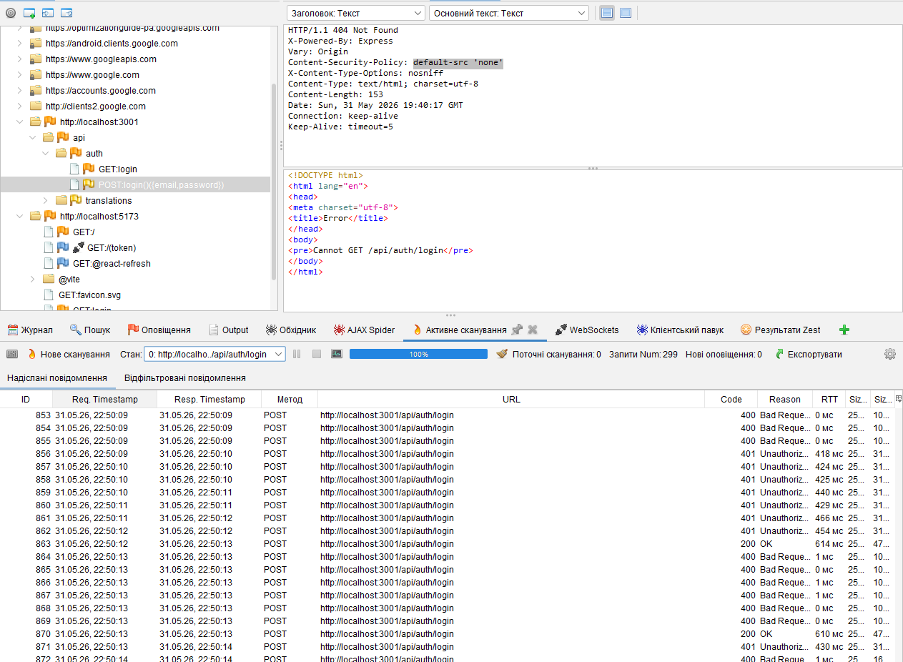
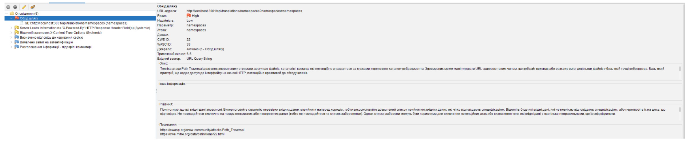
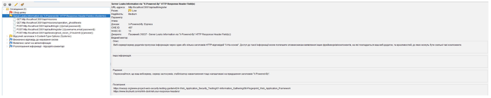
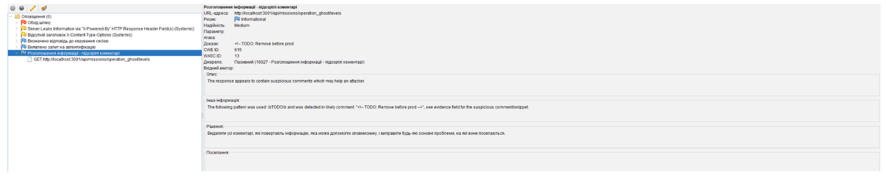
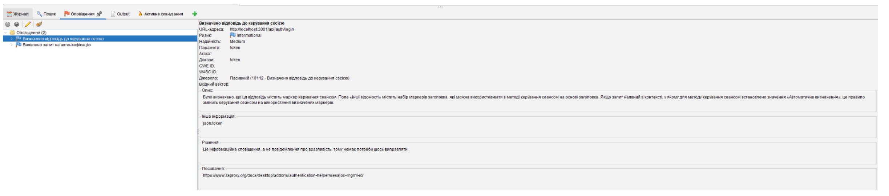

# Звіт OWASP ZAP — CyberTactics

Окремий звіт про **динамічне тестування безпеки (DAST)** backend API платформи CyberTactics інструментом [OWASP ZAP](https://www.zaproxy.org/). Деталі remediation та звʼязок з threat model — також у [weekly-report.md](./weekly-report.md) (тиждень 3) та [security-requirements.md](./security-requirements.md).

| Параметр | Значення |
|----------|----------|
| Ціль | `http://localhost:3001` (Express REST API) |
| Інструмент | OWASP ZAP (Desktop) |
| Метод | Проксі Postman → ZAP, ручні запити + Full Active Scan |
| Період | тиждень 3 розробки MVP (baseline → remediation → повторний scan) |

---

## 1. Мета перевірки

Зафіксувати початковий стан безпеки backend API, виявити потенційні ризики та сформувати перелік проблем для remediation до production.

---

## 2. Обсяг перевірки (API)

Під час сканування через Postman/ZAP викликано основні endpointʼи:

- `POST /auth/register`, `POST /auth/login`
- `GET /missions`, `GET /missions/:id/levels`
- `POST /levels/:id/submit`
- `GET /mitre/techniques`, `GET /mitre/techniques/:id`, `POST /mitre/sync`
- `GET /translations/languages`, `GET /translations`, `GET /translations/namespaces`
- `POST /translations`, `POST /translations/bulk`
- `GET /users/me`, `PUT /users/me/locale`, `PUT /users/me/avatar`
- `POST /users/me/stealth/masking`, `POST /users/me/stealth/wait`
- `GET /users/:id/progress`, `GET /users/:id/stats`

---

## 3. Методика

1. Налаштовано проксі між Postman та OWASP ZAP.
2. Вручну викликано основні API endpointʼи платформи.
3. ZAP зібрав HTTP-запити та відповіді.
4. Виконано **Full Active Scan** (299 запитів до auth/login та інших endpointʼів).
5. Зафіксовано alerts, групування за категоріями та скріншоти.

---

## 4. Baseline scan (до виправлень)

### 4.1. Огляд alerts

| № | Alert | Ризик | Надійність | OWASP / CWE | Коментар |
|---|-------|-------|------------|-------------|----------|
| 1 | Path Traversal | High | Low | OWASP A01, CWE-22 | `GET /api/translations/namespaces`, параметр `namespaces` |
| 2 | Missing X-Content-Type-Options | Low | Medium | OWASP A05, CWE-693 | Відсутній `X-Content-Type-Options: nosniff` |
| 3 | Server leaks information via X-Powered-By | Low | Medium | OWASP A05, CWE-497 | Backend розкриває `X-Powered-By: Express` |
| 4 | Suspicious comments | Informational | Medium | CWE-615 | У відповіді знайдено `TODO: Remove before prod` |
| 5 | Authentication request identified | Informational | High | — | ZAP визначив `/auth/login` як login endpoint |
| 6 | Session management response identified | Informational | Medium | — | ZAP визначив `token` у відповіді login |

### 4.2. Найкритичніші знахідки

**Path Traversal** — параметр `namespaces` на endpoint перекладів:

Потрібна whitelist-валідація, заборона `../`, `/`, `\`, encoded payloads; не використовувати user input для динамічних ключів.

**Security misconfiguration** — розкриття стеку та відсутність заголовків:

План: `helmet`, `app.disable('x-powered-by')`, `X-Content-Type-Options: nosniff`.

**Information disclosure** — службові коментарі у response:

План: прибрати debug/TODO з production-відповідей.

**Informational (auth flow)** — не вразливості, але підтверджують коректну ідентифікацію login/session ZAP.

---

## 5. Звʼязок зі STRIDE (скорочено)

| STRIDE | Ризик | Як проявляється | Контроль |
|--------|-------|-----------------|----------|
| Spoofing | Auth/session flow | Login + token у відповіді | JWT expiration, rate limiting, generic errors |
| Tampering | Path Traversal | `translations/namespaces` | Whitelist + schema validation |
| Information Disclosure | Stack / TODO / headers | X-Powered-By, коментарі, nosniff | Helmet, очистка response |
| Elevation of Privilege | Admin API | translations, MITRE sync | RBAC + admin guard |
| Denial of Service | Масові запити | login, submit, sync | Rate limiting |
| Repudiation | Критичні дії | admin, sync, submit | Audit logging |

---

## 6. Remediation (пріоритет)

| Пріоритет | Проблема | Дія |
|-----------|----------|-----|
| 1 | Path Traversal | Whitelist namespaces + validation + negative tests |
| 2 | Admin-захист translations / MITRE sync | RBAC middleware |
| 3 | Ownership progress/stats | userId лише з JWT |
| 4 | Security headers | Helmet |
| 5 | X-Powered-By | `app.disable('x-powered-by')` |
| 6 | TODO/debug у response | Очистити seed/content |
| 7 | Auth hardening | Rate limit, generic errors, JWT review |

---

## 7. Повторний baseline scan (після виправлень)

Залишилось **2 informational alerts**:

- Authentication Request Identified;
- Session Management Response Identified.

Це **не вразливості** — ZAP підтверджує, що `/api/auth/login` коректно ідентифіковано як auth flow, а відповідь містить session/token marker.

### Усунено під час remediation

- Path Traversal на `translations/namespaces`;
- відсутній `X-Content-Type-Options`;
- розкриття `X-Powered-By: Express`;
- TODO/debug-коментарі у відповідях API;
- посилено security headers та валідацію translations API;
- admin endpointʼи винесено під контроль доступу.

**Висновок:** повторний scan підтвердив ефективність security controls. Стан «до / після» показує зменшення ризиків misconfiguration, information disclosure та potential broken access control.

---

## 8. Скріншоти в репозиторії

| Файл | Зміст |
|------|-------|
| `img_24` | Дерево alerts — baseline |
| `img_28`–`img_33` | Деталі окремих alerts (див. також [weekly-report.md](./weekly-report.md)) |
| `img_35`–`img_36` | Результат після remediation |
| `img_62` | Active Scan (POST login) |

---

## Повʼязані документи

- [weekly-report.md](./weekly-report.md) — контекст тижня 3, повний текст аналізу
- [security-requirements.md](./security-requirements.md) — acceptance criteria та чеклисти
- [documentation.md](./documentation.md) — threat model, архітектура, перевірка безпеки