# Огляд інтерфейсу CyberTactics

Документ описує **користувацький інтерфейс** платформи CyberTactics: що бачить гравець або адміністратор на кожному екрані і які дії доступні. Технічні деталі (API, БД, архітектура) — у [documentation.md](./documentation.md).

Скріншоти зберігаються в [img/](./img/) під іменами `img_37.png` … `img_61.png`.

---

## Загальні елементи

### Мова інтерфейсу

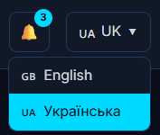

- Перемикач **UA / EN** у верхній панелі змінює мову всього інтерфейсу.
- Вибрана мова зберігається для наступних сесій.

### Сповіщення

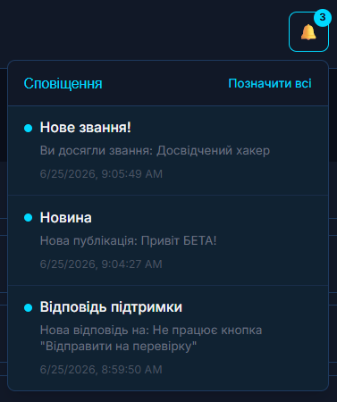

- Іконка дзвоника показує кількість непрочитаних сповіщень.
- У списку — нові звання, публікації новин, відповіді підтримки тощо.
- Кнопка **«Позначити всі»** знімає позначку «нове» з усіх записів.

---

## Вхід і профіль

### Вхід / реєстрація

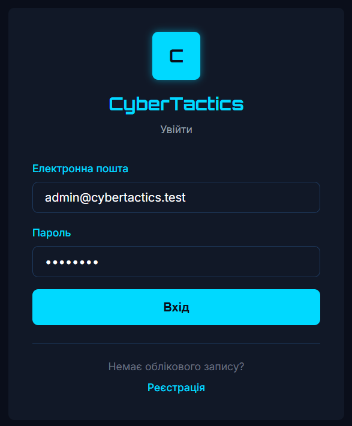

- Форма **електронної пошти** та **пароля** для входу.
- Посилання **«Реєстрація»** для створення нового облікового запису.

### Профіль

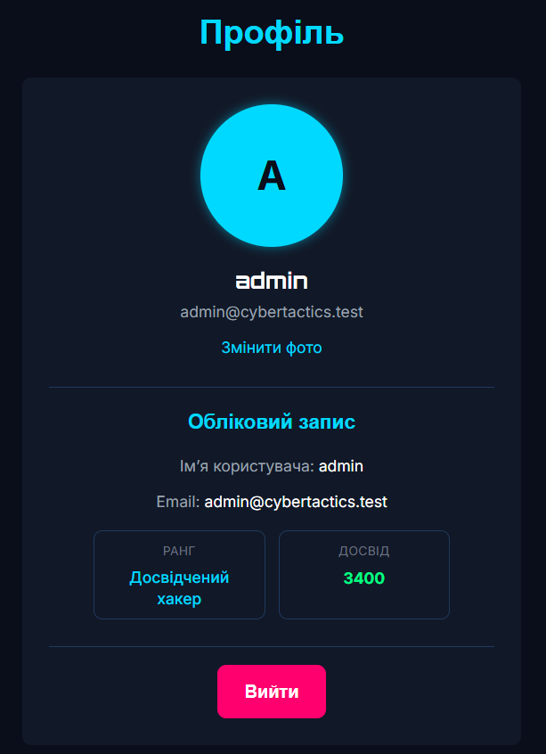

- Аватар, ім’я користувача та email.
- **«Змінити фото»** — завантаження та обрізка аватара.
- Поточний **ранг** і **досвід (XP)**.
- Кнопка **«Вийти»** завершує сесію.

---

## Місії та ігровий процес

### Каталог місій

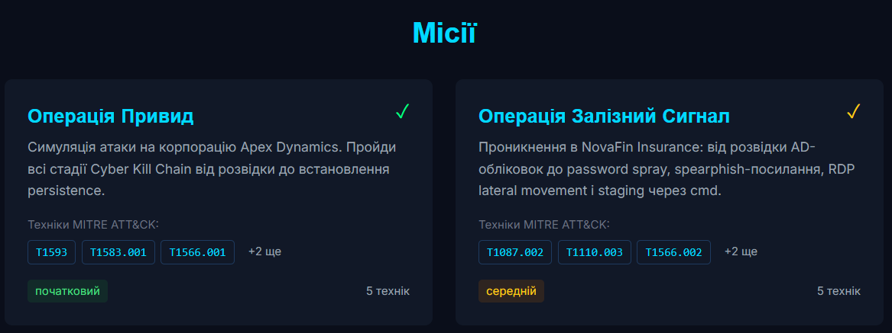

- Список доступних **кампаній** з описом сценарію.
- Для кожної місії — техніки MITRE ATT&CK, рівень складності, статус проходження.
- Клік по картці відкриває список завдань місії.

### Завдання місії

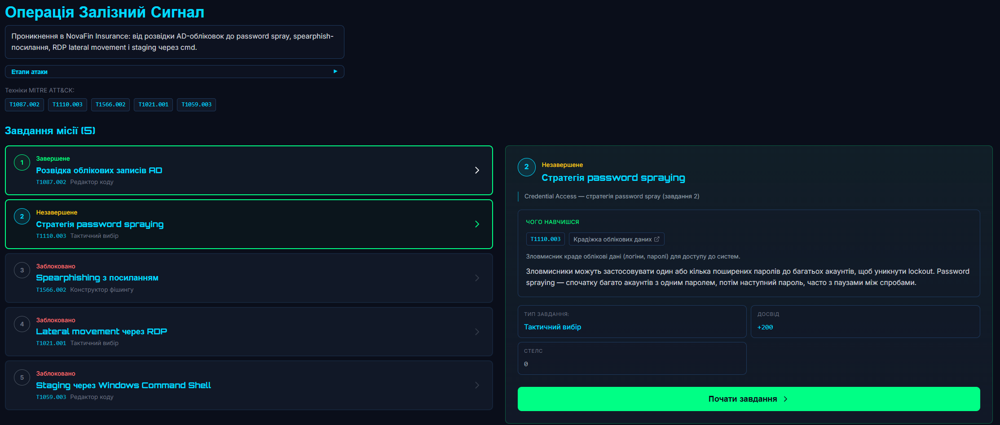

- Ліва колонка — **послідовність завдань** (завершене / поточне / заблоковане).
- Права колонка — опис обраного завдання: навчальні цілі, тип, XP, стелс.
- Кнопка **«Почати завдання»** запускає ігровий екран.
- Блок **«Етапи атаки»** показує Kill Chain місії.

### Kill Chain

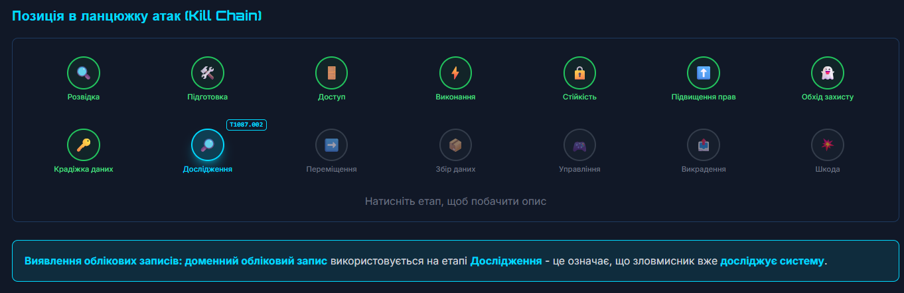

- Візуальна схема **етапів атаки** (від розвідки до впливу).
- Клік по етапу показує, як поточна техніка MITRE вписується в ланцюжок.

### Типи завдань у грі

**Regex** — аналіз текстових даних регулярним виразом:

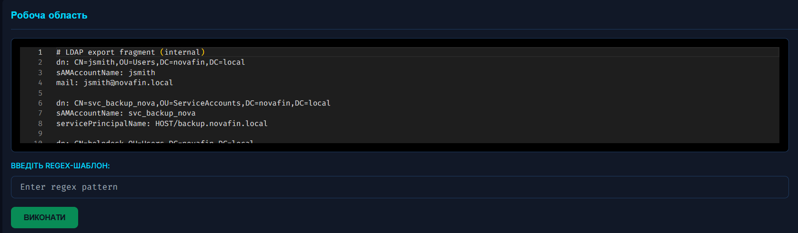

- Перегляд вхідних даних (наприклад, LDAP-фрагмент).
- Поле для regex-шаблону та кнопка **«Виконати»**.

**Тактичний вибір** — один правильний варіант зі списку:

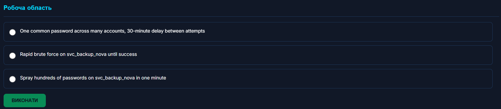

- Радіокнопки з варіантами відповіді.
- Підтвердження кнопкою **«Виконати»**.

**Конструктор фішингу** — збір листа з фраз і вкладень:

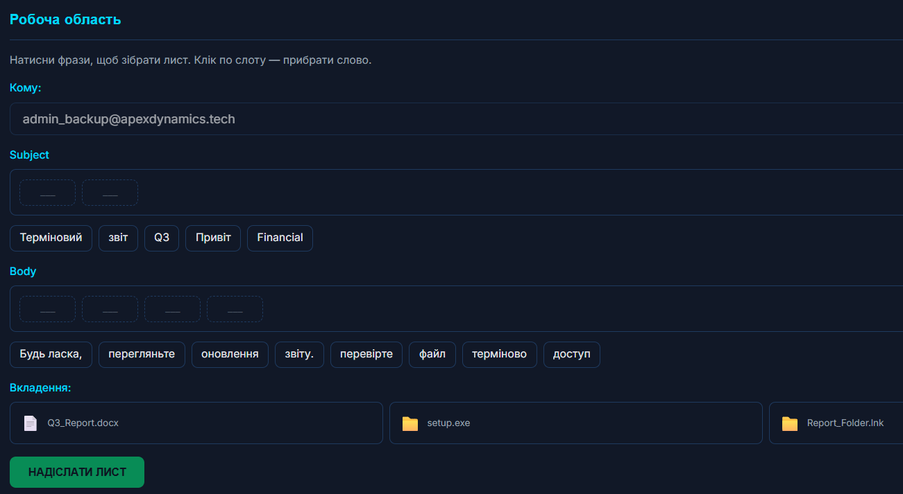

- Слоти для теми та тіла листа; клік по фразі додає її, клік по слоту — прибирає.
- Вибір вкладень (документ, exe, ярлик).
- **«Надіслати лист»** перевіряє збірку.

**Редактор коду** — написання команди за умовою:

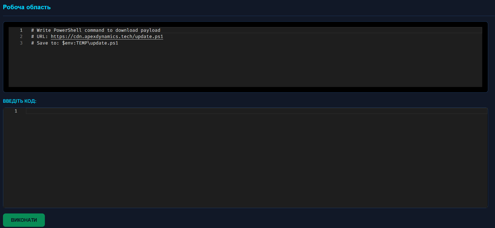

- Умова завдання у вигляді коментарів.
- Поле вводу коду та **«Виконати»**.

**Діалог і контекст** — супровід сценарію координатором:

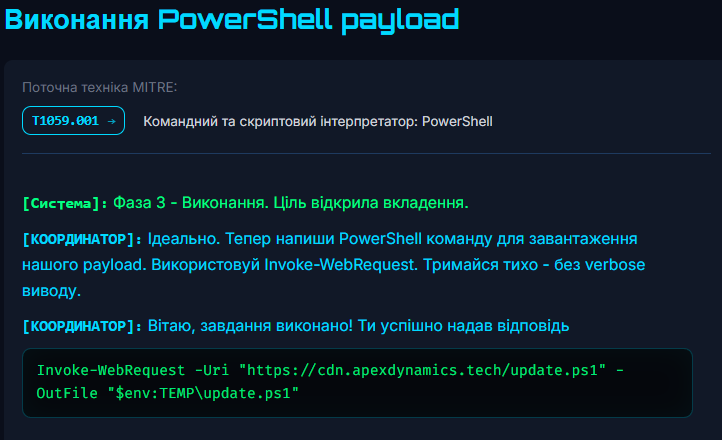

- Журнал повідомлень **[Система]** / **[Координатор]**.
- Поточна техніка MITRE та підказки до дії.
- Після успіху — підтвердження і приклад правильної відповіді.

**Вибір шляху реєстру** (persistence):

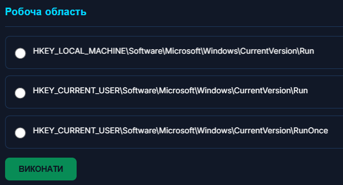

- Список ключів Windows Registry; один варіант на вибір.

---

## Навчання та прогрес

### Матриця навичок (MITRE ATT&CK)

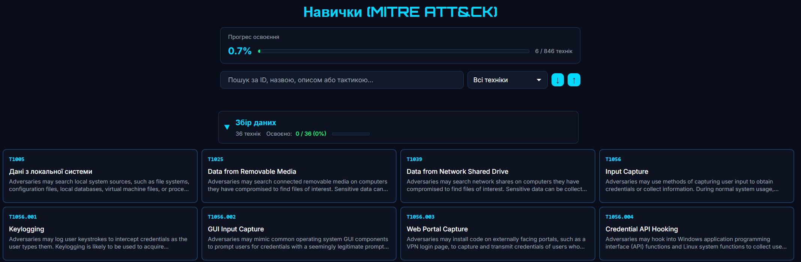

- Загальний **прогрес освоєння** технік (освоєно / усього).
- Пошук за ID, назвою, описом або тактикою.
- Фільтр (усі / освоєні / неосвоєні) та групування за **тактиками MITRE**.
- Клік по картці техніки відкриває детальне модальне вікно.

### Картка техніки MITRE

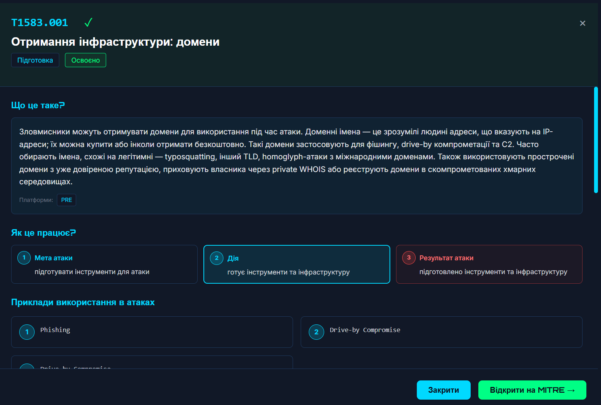

- Опис техніки, тактика, статус **«Освоєно»**.
- Блок **«Як це працює?»** — схема мета → дія → результат.

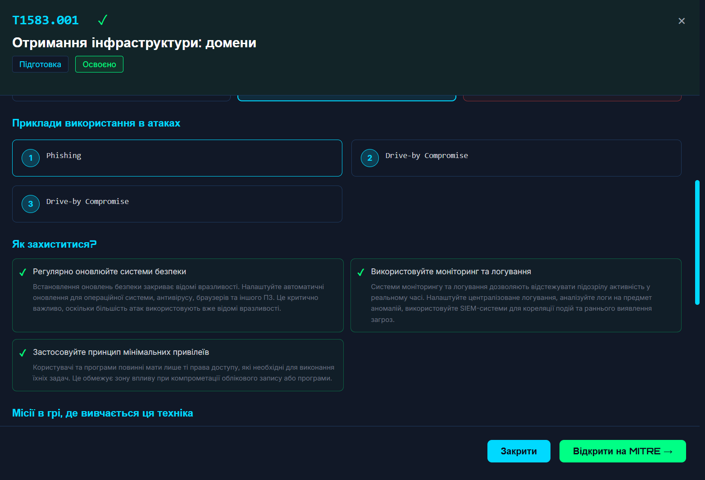

- Приклади використання в атаках.
- Рекомендації **«Як захиститися?»**.
- Місії, де вивчається техніка; посилання **«Відкрити на MITRE»**.

### Таблиця лідерів

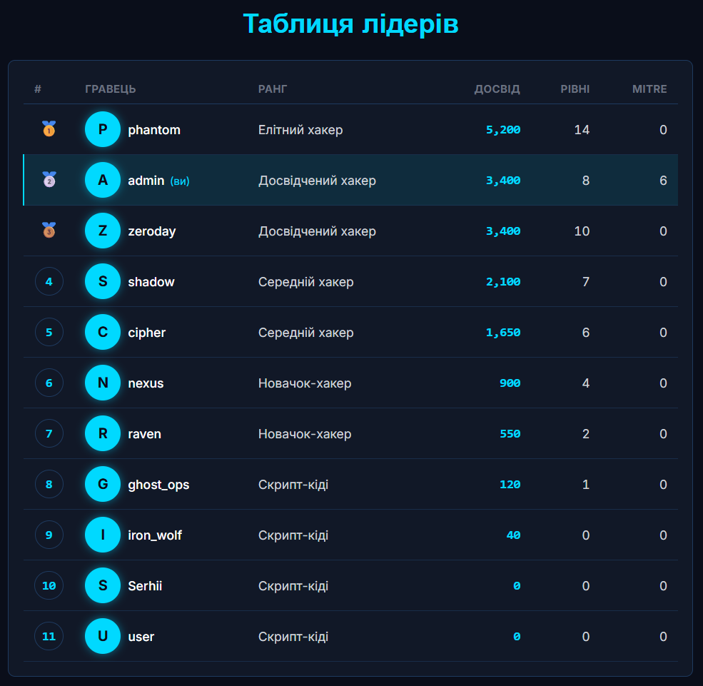

- Рейтинг гравців за **досвідом**, кількістю **рівнів** і **технік MITRE**.
- Медалі для топ-3; рядок поточного користувача виділено.

### Звання

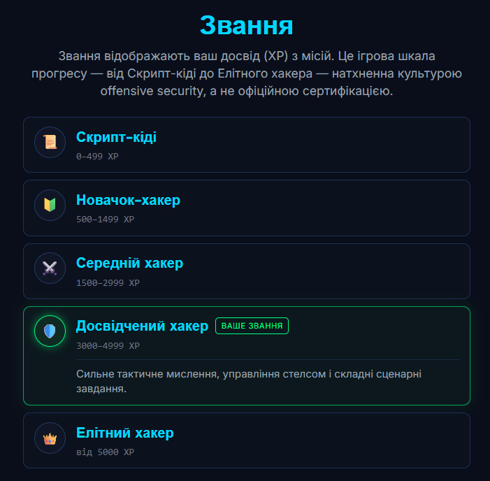

- Шкала від **Скрипт-кіді** до **Елітного хакера** з діапазонами XP.
- Поточне звання позначено міткою **«Ваше звання»**.

---

## Інформаційні розділи

### Новини

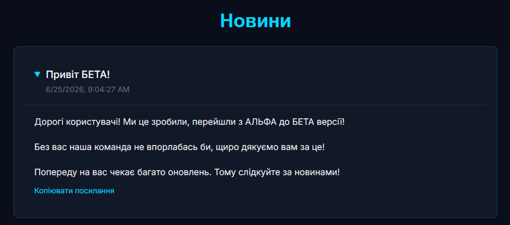

- Список публікацій адміністрації; розгортання тексту.
- **«Копіювати посилання»** на окрему новину.

### FAQ

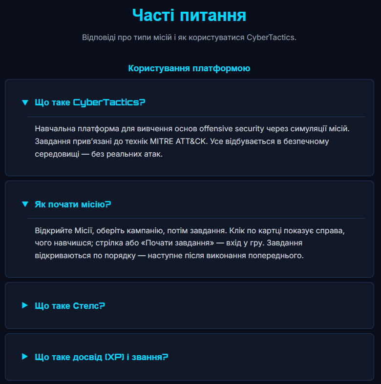

- Акордеон з відповідями про платформу, місії, стелс, XP і звання.

### Спільнота

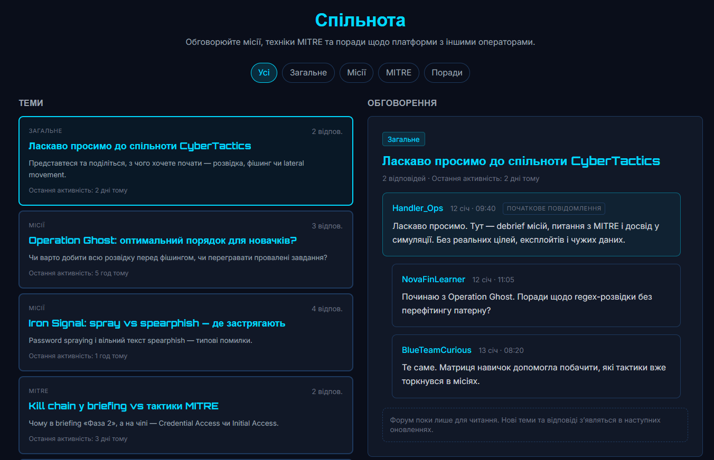

- Теми за категоріями (загальне, місії, MITRE, поради).
- Перегляд обговорень; на момент знімка форум **лише для читання**.

---

## Підтримка та адміністрування

> Екрани нижче доступні лише користувачам з роллю **ADMIN** (окрім звернень користувача на `/support`, без окремого скріншота).

### Звернення (адмін)

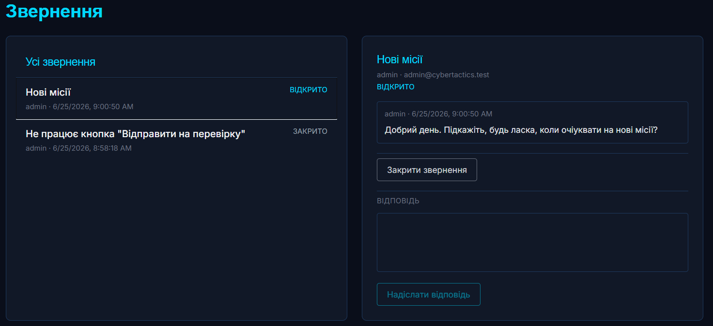

- Список тікетів зі статусами **Відкрито** / **Закрито**.
- Перегляд листування, **«Надіслати відповідь»**, **«Закрити звернення»**.

### Користувачі (налаштування)

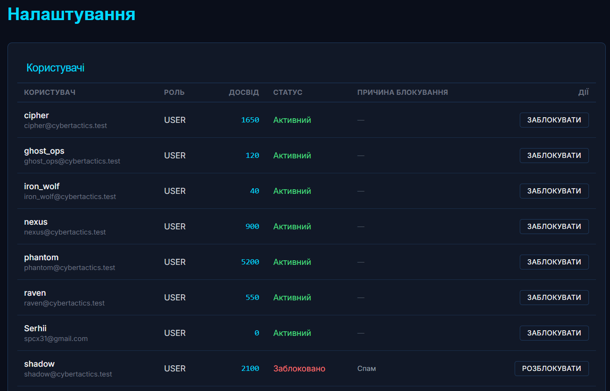

- Таблиця користувачів: роль, досвід, статус.
- **«Заблокувати»** / **«Розблокувати»** з указанням причини блокування.

### MITRE ATT&CK (синхронізація)

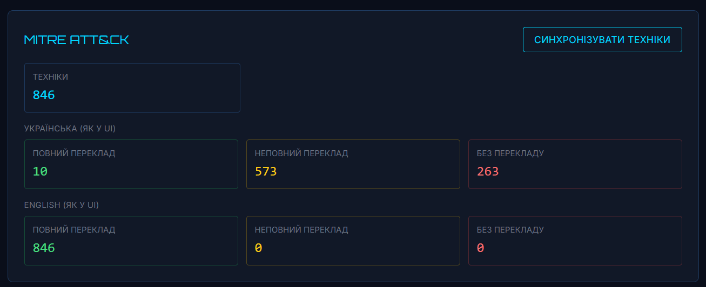

- Кількість технік у базі та статистика **перекладів** (UK / EN).
- Кнопка **«Синхронізувати техніки»** оновлює дані з MITRE.

### Керування новинами

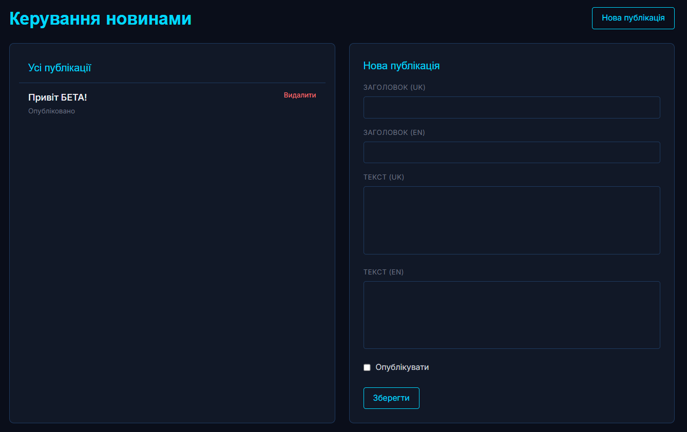

- Список публікацій з можливістю **видалити**.
- Форма **нової публікації** (заголовок і текст UK + EN), прапорець **«Опублікувати»**, **«Зберегти»**.

---

## Пов’язані документи

| Документ | Зміст |
|----------|--------|
| [documentation.md](./documentation.md) | Архітектура, API, бізнес-логіка |
| [security-requirements.md](./security-requirements.md) | Вимоги безпеки |
| [weekly-report.md](./weekly-report.md) | Звіт виконання (інші скріни `img_1` … `img_36`) |